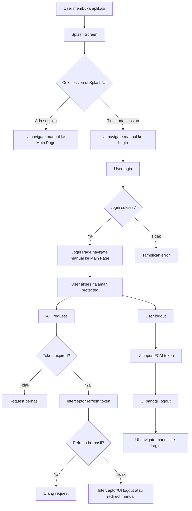
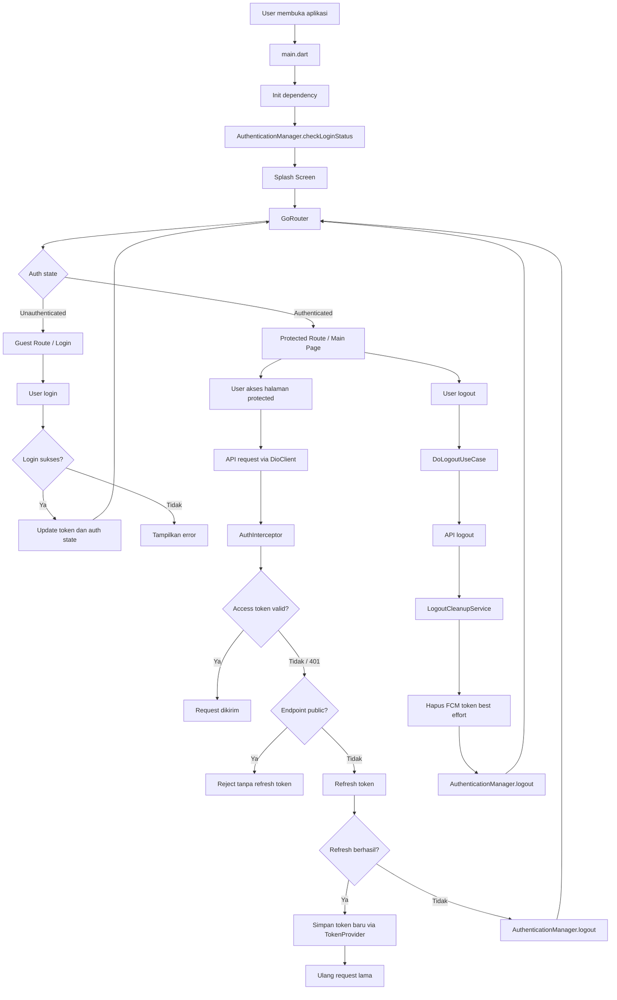
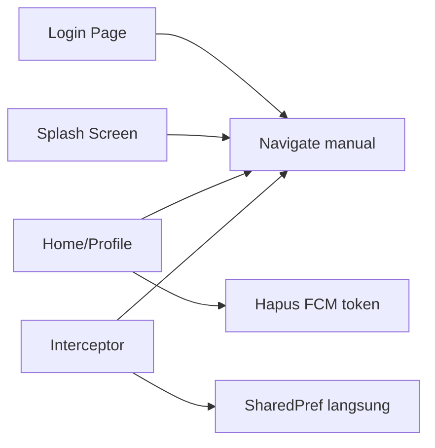
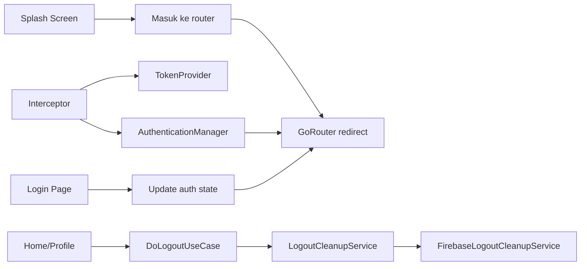
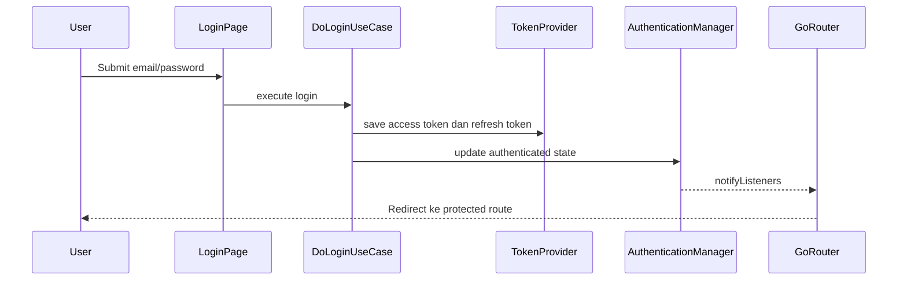
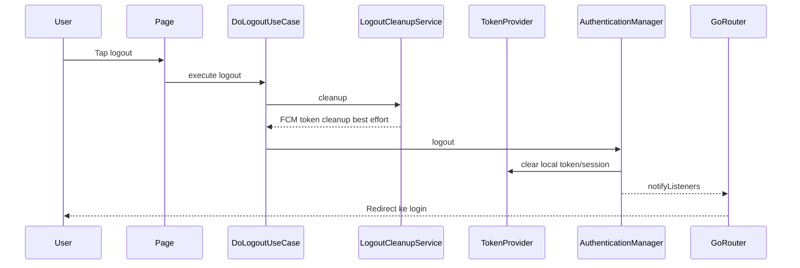
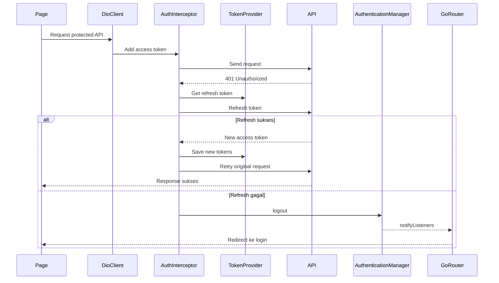

# Hasil Implementasi Auth, Logout, API Client, dan Running Project

Dokumen ini merangkum perubahan yang sudah diterapkan pada project `komtim_partner`, terutama untuk membuat flow auth lebih aman, konsisten, dan lebih terpusat seperti konsep yang ada di `news-app-flutter`, tanpa mengambil mentah-mentah implementasinya.

## 1. Auth Flow dan Routing

### File yang diubah

- `lib/common/global/router/app_router.dart`
- `lib/main.dart`
- `lib/features/auth/splash_screen.dart`
- `lib/features/auth/view/login_page.dart`
- `lib/features/auth/view/change_password_page.dart`

### Sebelumnya

- Beberapa halaman masih melakukan navigasi auth secara manual.
- Setelah login berhasil, halaman login langsung mengarahkan user ke halaman utama.
- Setelah logout atau change password, halaman tertentu langsung mengarahkan user ke login.
- Splash screen ikut menentukan apakah user harus masuk ke login atau main page.
- Logic auth tersebar di beberapa UI.

### Sekarang

- `GoRouter` menjadi pusat pengaturan akses halaman.
- `AuthenticationManager` dipakai sebagai `refreshListenable` untuk `GoRouter`.
- Ketika status login berubah, router otomatis melakukan redirect.
- Route publik tetap bisa dibuka tanpa login, seperti:
  - login
  - forgot password
  - splash
  - force update
- Route selain route publik dianggap protected secara default.
- UI tidak lagi menjadi tempat utama untuk memutuskan redirect auth.

### Dampak

- Flow auth lebih konsisten.
- Redirect login/logout lebih mudah dikontrol dari satu tempat.
- Risiko beda behavior antar halaman menjadi lebih kecil.
- Lebih mudah dikembangkan untuk flow login, forgot password, dan PIN.

## 2. Login

### File yang diubah

- `lib/features/auth/view/login_page.dart`
- `lib/core/domain/usecases/do_login_use_case.dart`
- `lib/common/global/router/app_router.dart`

### Sebelumnya

- Setelah login sukses, halaman login langsung menjalankan navigasi manual ke main page.

### Sekarang

- Login cukup melakukan proses autentikasi dan update auth state.
- Setelah auth state berubah, `GoRouter` otomatis mengarahkan user ke halaman yang sesuai.

### Dampak

- UI login menjadi lebih bersih.
- Navigasi tidak dobel antara UI dan router.
- Auth state menjadi sumber kebenaran utama.

## 3. Forgot Password dan Change Password

### File yang diubah

- `lib/features/auth/view/change_password_page.dart`
- `lib/common/global/router/app_router.dart`
- `lib/core/data/apiservice/interceptors/auth_interceptor.dart`

### Sebelumnya

- Beberapa redirect setelah proses password masih dilakukan langsung dari halaman.
- Endpoint public belum sepenuhnya dipisahkan secara jelas di interceptor.

### Sekarang

- Forgot password diperlakukan sebagai route guest/public.
- Change password tetap masuk protected flow.
- Setelah change password sukses, session di-logout melalui `AuthenticationManager`.
- Router yang menentukan user kembali ke login.
- Endpoint public seperti login, refresh token, dan forgot password tidak dipaksa masuk logic refresh token.

### Dampak

- Flow password lebih konsisten.
- Perpindahan halaman tidak tersebar di UI.
- Interceptor tidak salah melakukan refresh token untuk endpoint public.

## 4. PIN Flow

### File yang terkait

- `lib/common/global/router/app_router.dart`
- modul PIN existing di project

### Sebelumnya

- PIN sudah ada di project, tetapi aksesnya mengikuti pola routing lama.

### Sekarang

- Route PIN termasuk area protected.
- User harus punya session valid sebelum masuk ke halaman PIN.

### Dampak

- PIN tetap dipertahankan sebagai bagian dari keamanan lokal.
- PIN tidak dibuat menjadi public route.
- Flow PIN lebih sejajar dengan auth state utama.

## 5. Logout

### File yang diubah atau ditambahkan

- `lib/core/domain/usecases/do_logout_use_case.dart`
- `lib/core/domain/services/logout_cleanup_service.dart`
- `lib/core/data/services/firebase_logout_cleanup_service.dart`
- `lib/features/home/view/home_page.dart`
- `lib/features/home/view/profile_page.dart`
- `lib/DI/injection.dart`

### Sebelumnya

- Logout masih memiliki cleanup yang tersebar di UI.
- `FirebaseMessaging.instance.deleteToken()` dipanggil langsung dari halaman.
- Beberapa halaman masih melakukan navigasi manual ke login setelah logout.

### Sekarang

- Logout dipusatkan di `DoLogoutUseCase`.
- Cleanup tambahan dipisahkan ke `LogoutCleanupService`.
- Penghapusan FCM token dipindahkan ke `FirebaseLogoutCleanupService`.
- UI hanya memanggil proses logout.
- Setelah logout selesai, `AuthenticationManager` menghapus session lokal.
- Router otomatis mengarahkan user ke login.

### Dampak

- Logout lebih rapi dan konsisten.
- UI tidak lagi bertanggung jawab menghapus token Firebase.
- Jika nanti ada cleanup lain, cukup ditambahkan di service logout.
- Logout tetap berjalan walaupun cleanup FCM gagal, karena cleanup dibuat best effort.

## 6. API Client, Token, dan Interceptor

### File yang diubah atau ditambahkan

- `lib/core/data/apiservice/token_provider.dart`
- `lib/core/data/datasources/preferences/shared_pref.dart`
- `lib/core/data/apiservice/interceptors/auth_interceptor.dart`
- `lib/DI/injection.dart`

### Sebelumnya

- Interceptor bergantung langsung ke `SharedPref`.
- Token storage dan API interceptor masih cukup terikat.
- Refresh token belum sejelas sekarang dalam pemisahan endpoint public dan protected.
- Interceptor masih punya risiko terlalu banyak tahu detail storage/session.

### Sekarang

- Dibuat kontrak `TokenProvider`.
- `SharedPref` mengimplementasikan `TokenProvider`.
- `AuthInterceptor` hanya tahu cara mengambil, menyimpan, dan menghapus token lewat kontrak tersebut.
- Endpoint public dipisahkan agar tidak masuk flow refresh token.
- Jika access token expired, interceptor mencoba refresh token.
- Jika refresh token berhasil, request lama diulang dengan token baru.
- Jika refresh token gagal, user di-logout lewat `AuthenticationManager`.
- Interceptor tidak melakukan navigasi langsung.

### Dampak

- API client lebih konsisten.
- Token handling lebih mudah diuji.
- Storage token bisa diganti tanpa mengubah interceptor secara besar.
- Logic refresh token lebih aman dari benturan request paralel.

## 7. Dependency Injection

### File yang diubah

- `lib/DI/injection.dart`

### Sebelumnya

- Dependency untuk auth, token, interceptor, dan logout cleanup belum sepenuhnya dipisahkan.

### Sekarang

- `TokenProvider` didaftarkan dari instance `SharedPref`.
- `AuthInterceptor` menerima `TokenProvider` dan `AuthenticationManager`.
- `LogoutCleanupService` didaftarkan memakai `FirebaseLogoutCleanupService`.
- `DoLogoutUseCase` menerima `LogoutCleanupService`.

### Dampak

- Dependency lebih eksplisit.
- Alur auth dan logout lebih mudah dilacak.
- Service tidak saling bergantung terlalu langsung ke detail implementasi.

## 8. VS Code Running Tanpa FVM

### File yang diubah

- `.vscode/launch.json`
- `.vscode/settings.json`

### Sebelumnya

- VS Code diarahkan ke Flutter SDK dari `.fvm/versions/...`.
- `launch.json` hanya punya satu konfigurasi default.

### Sekarang

- VS Code tidak lagi mengunci SDK ke FVM.
- Project memakai Flutter global dari PATH.
- `launch.json` punya konfigurasi:
  - `Komtim Partner Dev`
  - `Komtim Partner Staging`
  - `Komtim Partner Production`
- Tiap konfigurasi memakai:
  - `--flavor`
  - `--dart-define=FLAVOR=...`

### Dampak

- Running dari VS Code lebih jelas.
- Bisa pilih environment langsung dari Run and Debug.
- Tidak bergantung ke FVM.

## 9. Android dan Dependency Build

### File yang diubah

- `android/app/build.gradle`
- `pubspec.yaml`
- `pubspec.lock`

### Sebelumnya

- `compileSdkVersion` masih `35`.
- Plugin seperti `integration_test` dan `share_plus` membutuhkan compile SDK `36`.
- `google_fonts` masih berada di versi lama yang bermasalah dengan Flutter/Dart global lebih baru.

### Sekarang

- `compileSdkVersion` dinaikkan ke `36`.
- `google_fonts` dinaikkan ke `^8.1.0`.
- `pubspec.lock` diperbarui lewat `flutter pub get`.

### Dampak

- Error compile SDK sudah selesai.
- Error `google_fonts_variant.dart` sudah selesai.
- Project bisa build dengan Flutter global.

## 10. Hasil Validasi

Validasi yang sudah dilakukan:

- `flutter pub get` berhasil.
- `flutter build apk --debug --flavor dev --dart-define=FLAVOR=dev` berhasil.
- APK debug berhasil dibuat di:

```text
build\app\outputs\flutter-apk\app-dev-debug.apk
```

## 11. Kesimpulan

Setelah implementasi ini, auth flow menjadi lebih terpusat dan konsisten.

Perbedaan paling penting dibanding sebelumnya:

- Redirect auth sekarang ditangani oleh `GoRouter`.
- UI tidak lagi mengatur navigasi login/logout secara manual.
- Logout cleanup dipindahkan ke service.
- FCM token dihapus dari logout service, bukan dari halaman.
- API interceptor tidak bergantung langsung ke detail storage.
- Token handling memakai kontrak `TokenProvider`.
- Running project sudah disiapkan tanpa FVM.
- Build Android sudah disesuaikan dengan SDK dan dependency terbaru.

Secara konsep, project sekarang lebih aman, lebih rapi, dan lebih siap untuk menjaga flow login, forgot password, logout, dan PIN tetap konsisten.

## 12. Diagram Flow Sebelum dan Sesudah

Diagram berikut bisa dipakai untuk menjelaskan perbedaan alur sebelum dan sesudah implementasi.

### Auth Flow Sebelum



### Masalah Pada Flow Sebelum

- Splash, Login Page, Home/Profile, dan Interceptor sama-sama bisa ikut menentukan arah navigasi.
- Logic redirect tersebar di beberapa tempat.
- Logout cleanup seperti hapus FCM token berada di UI.
- Interceptor terlalu dekat dengan detail storage token.
- Perubahan auth state belum sepenuhnya menjadi sumber utama navigasi.

### Auth Flow Sesudah



### Keuntungan Flow Sesudah

- `GoRouter` menjadi pusat keputusan navigasi auth.
- `AuthenticationManager` menjadi sumber utama status login.
- UI cukup menjalankan action, bukan mengatur redirect manual.
- Logout cleanup dipusatkan di service.
- FCM token dihapus saat logout melalui service, bukan dari halaman.
- `AuthInterceptor` menangani refresh token tanpa navigasi langsung.
- Token storage diakses lewat kontrak `TokenProvider`.

## 13. Diagram Perbandingan Tanggung Jawab

### Sebelum



### Sesudah



## 14. Diagram Ringkas Login, Logout, dan Refresh Token

### Login



### Logout



### Refresh Token


