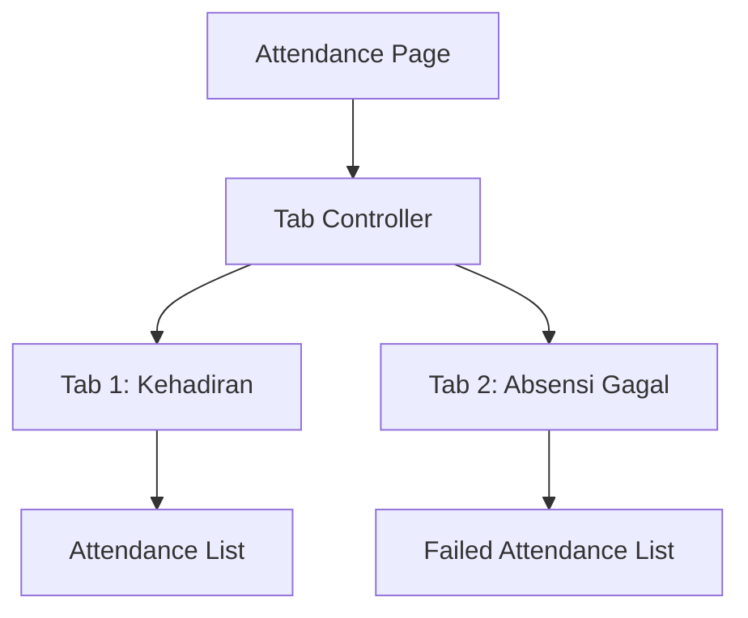
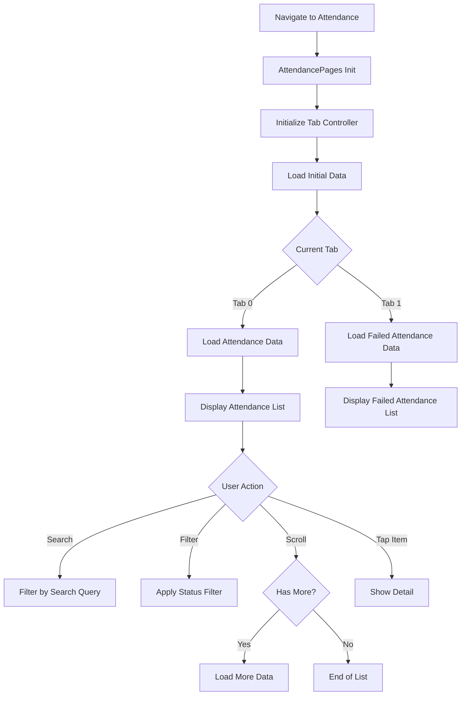
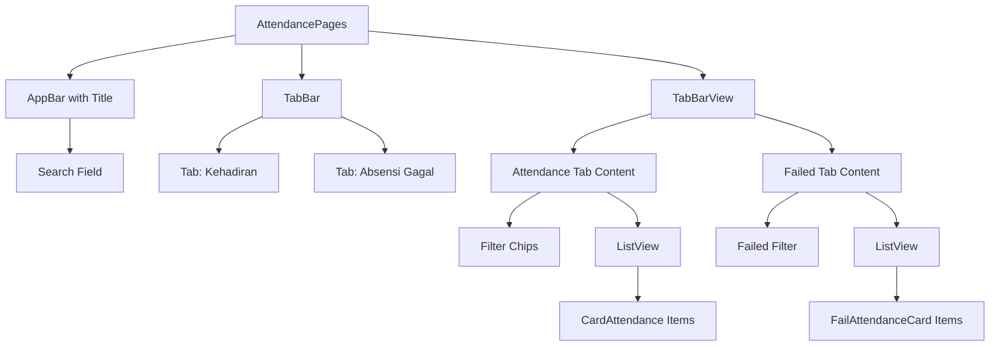
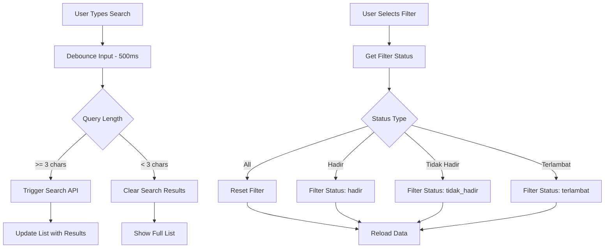
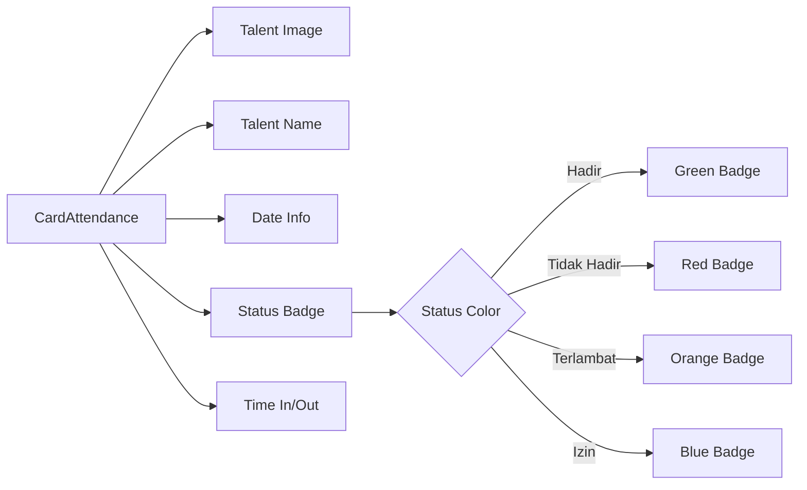
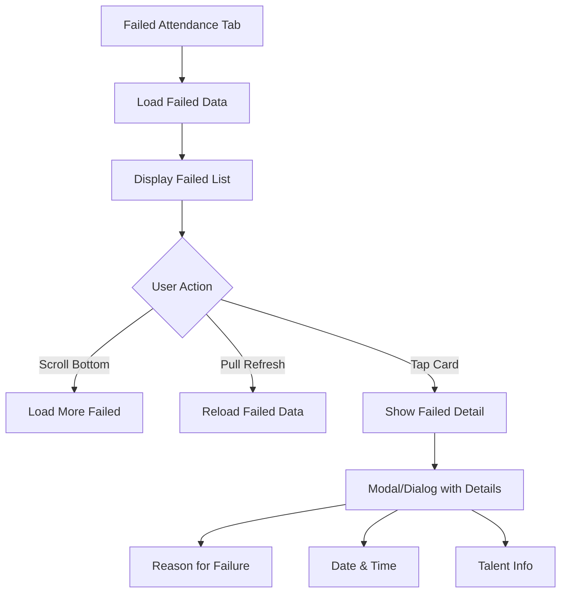
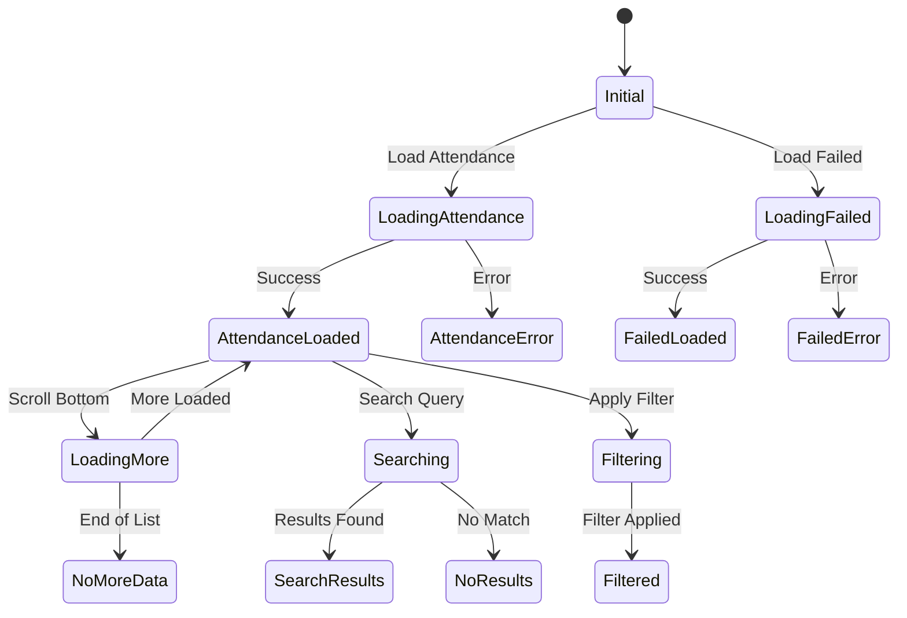
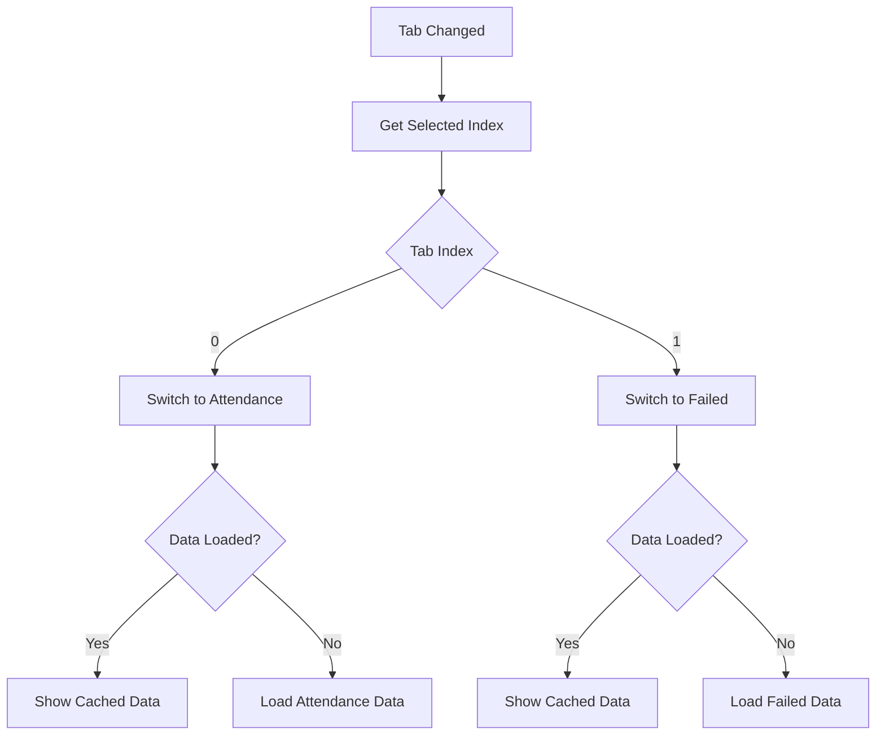
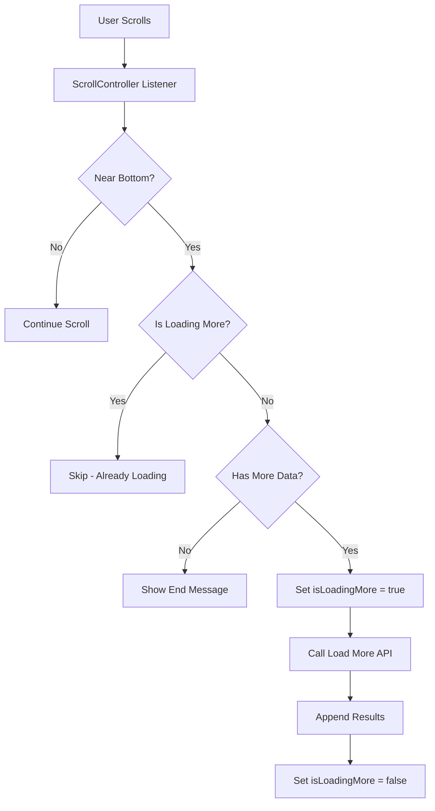
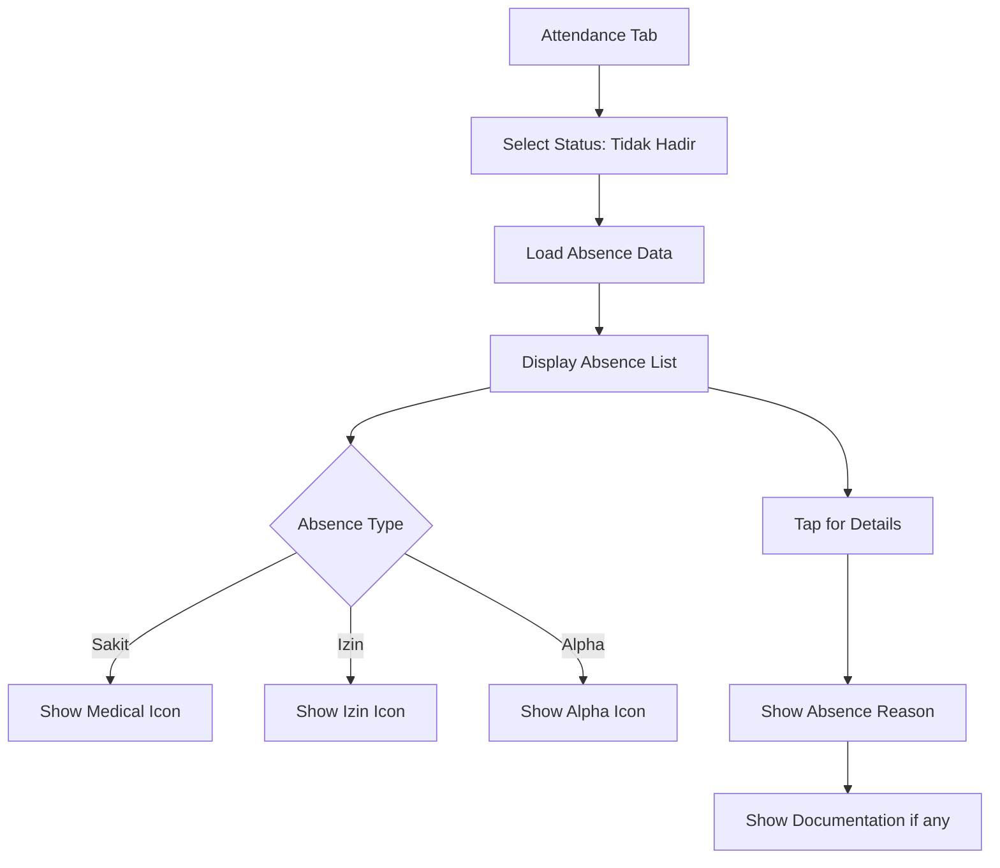

# Attendance Tracking Flow

## Deskripsi
Flow absensi talent mencakup daftar kehadiran, laporan ketidakhadiran, dan pengelolaan absensi gagal.

---

## 1. Attendance Page Overview



---

## 2. Main Attendance Flow



---

## 3. Attendance List View



---

## 4. Search & Filter Flow



---

## 5. Attendance Card Component



---

## 6. Failed Attendance Flow



---

## 7. Attendance BLoC State



---

## 8. Tab Selection Handler



---

## 9. Pagination Flow



---

## 10. Absence Report Flow



---

## Components

### BLoC Files
- `attendance_bloc.dart` - Attendance data logic
- `attendance_event.dart` - Events
- `attendance_state.dart` - States

### Views
- `attendance_pages.dart` - Main attendance page

### Widgets
- `card_attendance.dart` - Attendance item card
- `card_empty_list.dart` - Empty state
- `fail_attendance_card.dart` - Failed attendance card
- `shimmer_place_holder.dart` - Loading placeholder
- `shimmer_place_holder_fail.dart` - Failed list placeholder

---

## Data Models

```dart
class AttendanceModel {
  final int id;
  final String talentName;
  final String status; // hadir, tidak_hadir, terlambat, izin
  final DateTime date;
  final String? timeIn;
  final String? timeOut;
  final String? note;
}

class FailedAttendanceModel {
  final int id;
  final String talentName;
  final String reason;
  final DateTime date;
  final String failureType;
}
```

---

## Filter Status Mapping

| Display Name | API Status Value |
|--------------|------------------|
| Semua | (no filter) |
| Hadir | hadir |
| Tidak Hadir | tidak_hadir |
| Terlambat | terlambat |
| Izin | izin |
