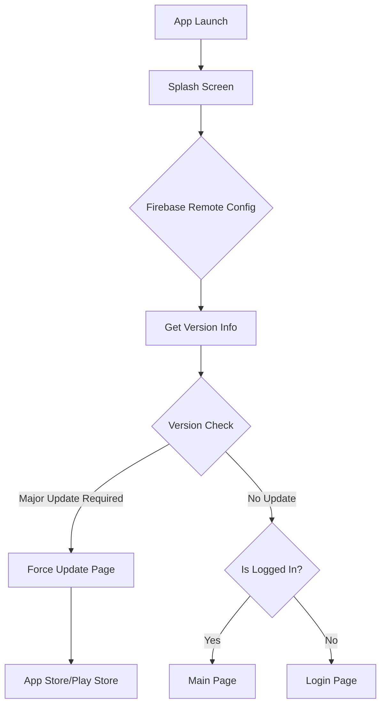
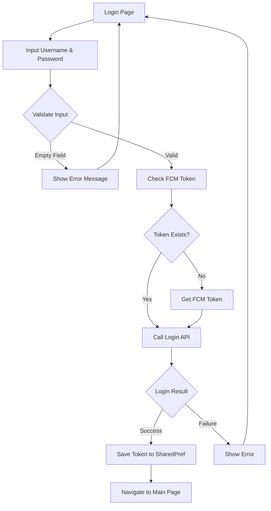
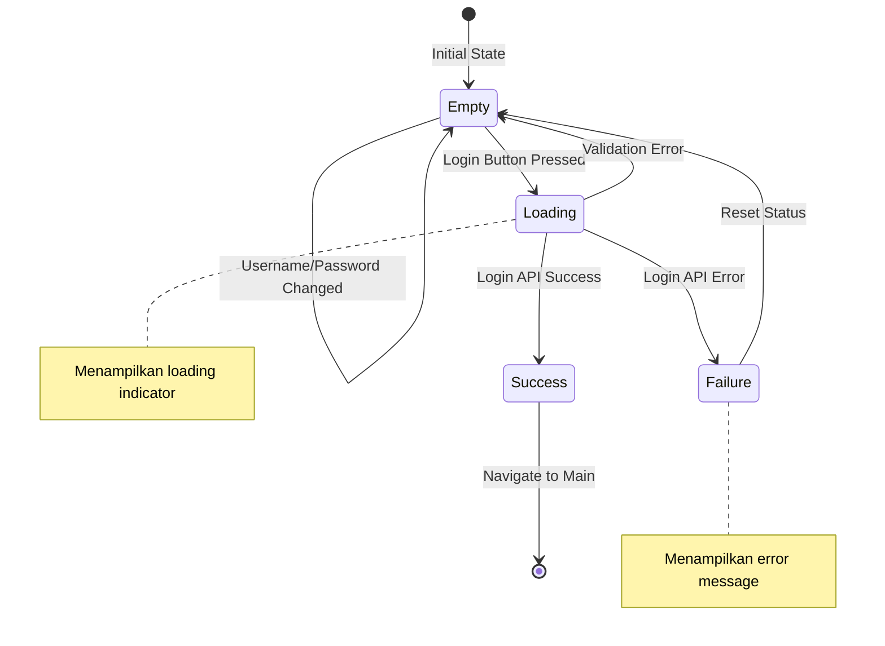
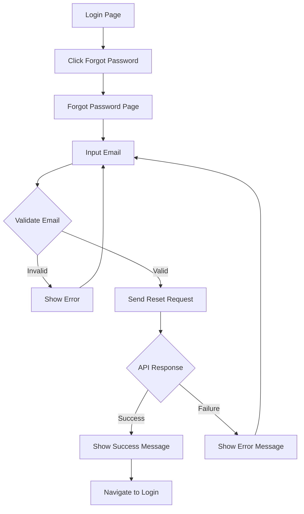
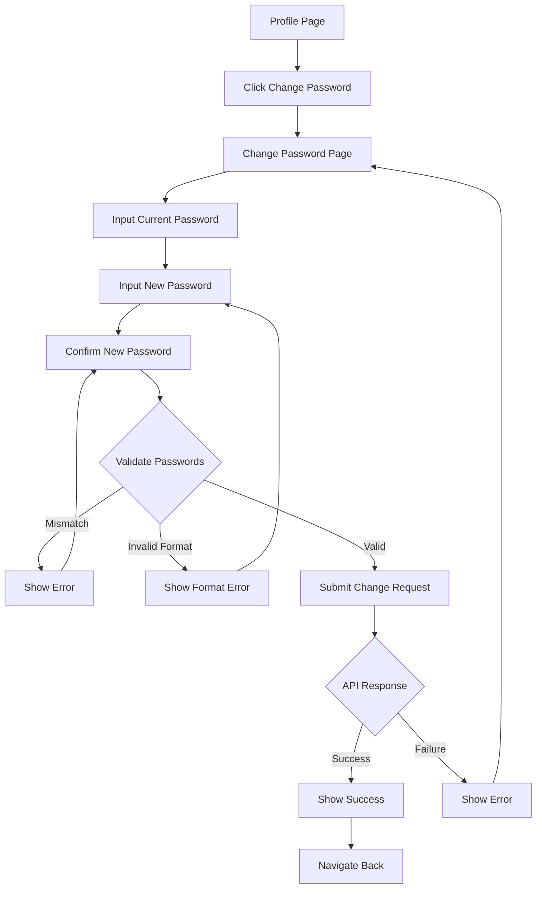
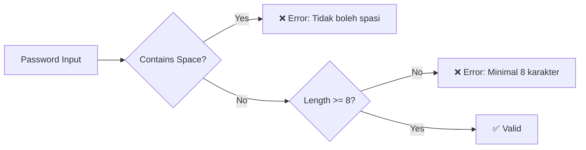
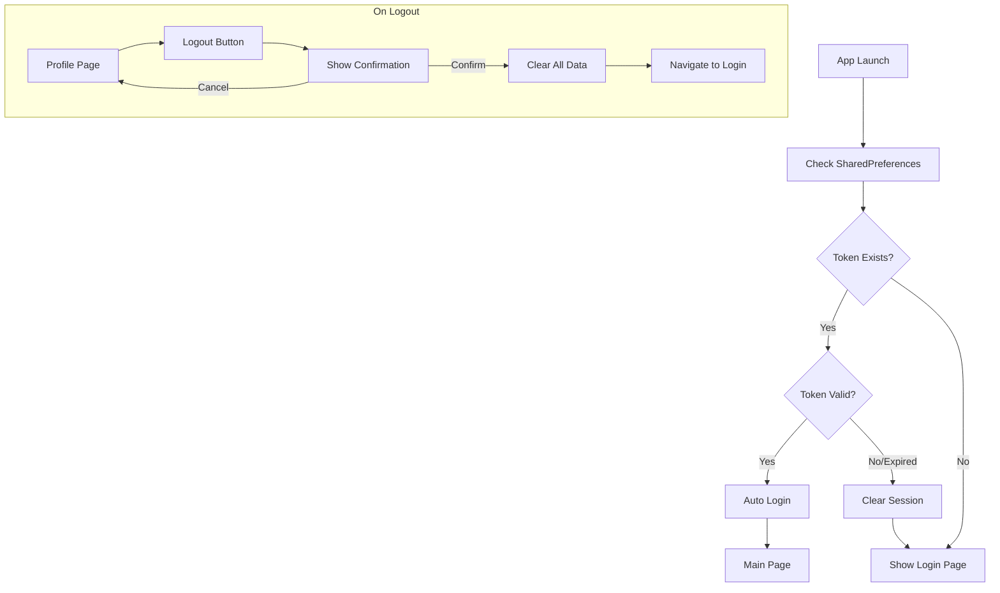
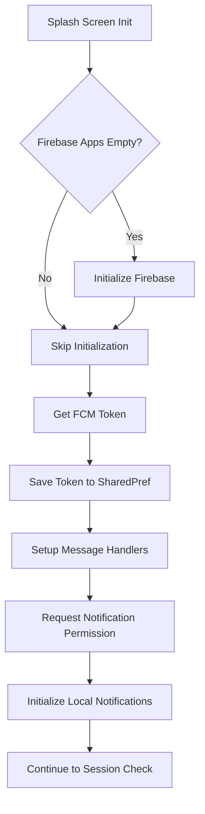

# Authentication Flow

## Deskripsi
Flow autentikasi mencakup proses login, lupa password, dan manajemen sesi pengguna.

---

## 1. Splash & Session Check Flow

---

## 2. Login Flow

---

## 3. Login BLoC State Flow

---

## 4. Forgot Password Flow

---

## 5. Change Password Flow

---

## 6. Password Validation Rules

---

## 7. Session Management

---

## 8. Firebase Initialization Flow

---

## Components

### BLoC Files
- `login_bloc.dart` - Handle login logic
- `login_event.dart` - Login events
- `login_state.dart` - Login states
- `forgot_password_bloc.dart` - Handle forgot password
- `change_password_bloc.dart` - Handle password change

### Views
- `splash_screen.dart` - Initial splash screen
- `login_page.dart` - Login form
- `forgot_password_page.dart` - Password reset form
- `change_password_page.dart` - Change password form

### Use Cases
- `DoLoginUseCase` - Execute login API call

---

## Error Handling

| Error Type | Message | Action |
|------------|---------|--------|
| Empty Username | "Username tidak boleh kosong" | Focus username field |
| Empty Password | "Password tidak boleh kosong" | Focus password field |
| Password with Space | "Password tidak boleh menggunakan spasi" | Clear password |
| Password < 8 chars | "Password minimal 8 karakter" | Keep input |
| Invalid Credentials | "Username atau password salah" | Clear password |
| Network Error | Error message dari API | Show retry option |
