# Home & Navigation Flow

## Deskripsi
Flow navigasi utama aplikasi mencakup dashboard home, riwayat transaksi, dan profil pengguna.

---

## 1. Main Navigation Structure

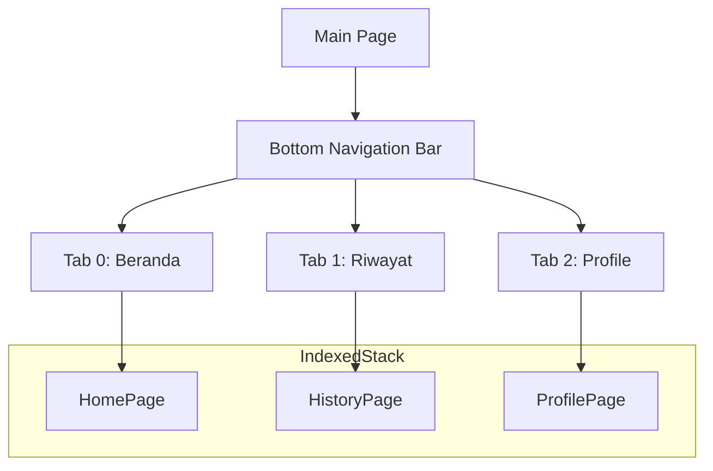

---

## 2. Home Page Flow

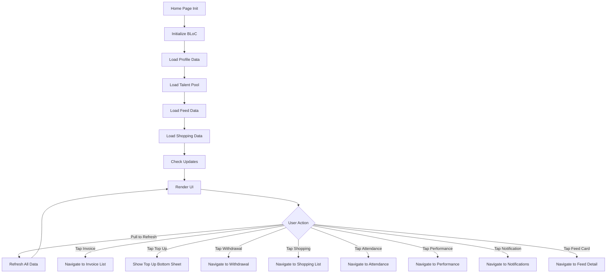

---

## 3. Home Page UI Components

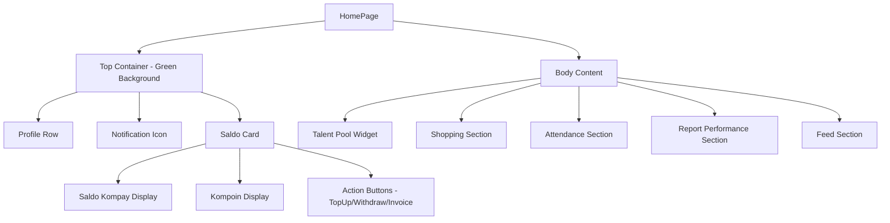

---

## 4. History Page Flow

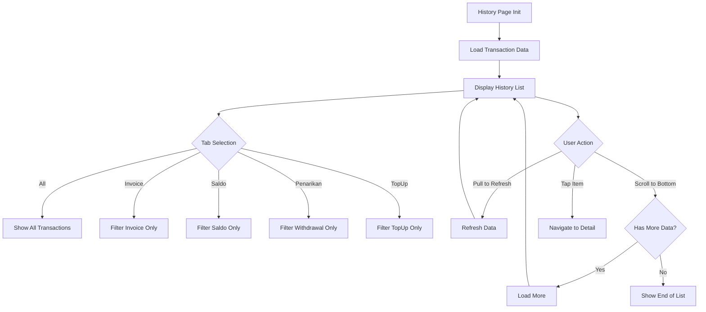

---

## 5. History Transaction Types

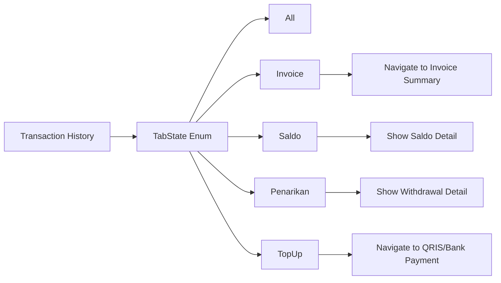

---

## 6. Profile Page Flow

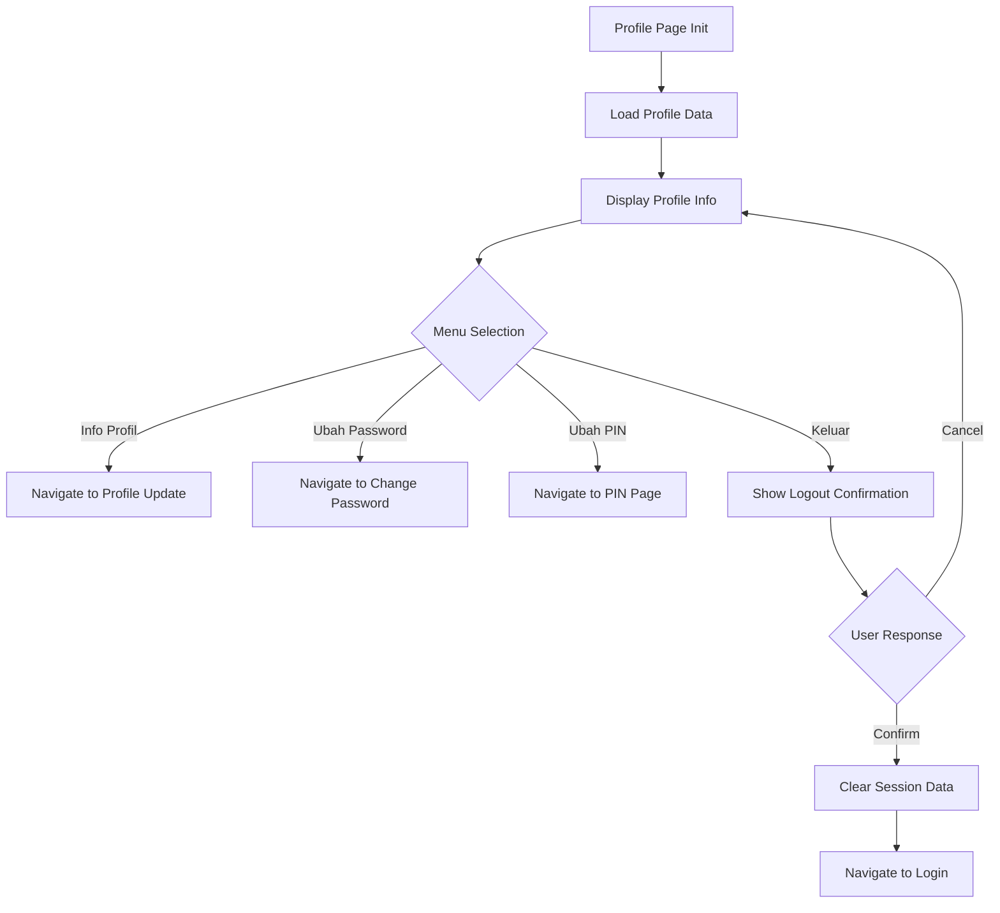

---

## 7. Profile Page Components

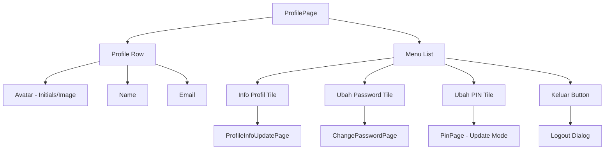

---

## 8. Home BLoC State Flow

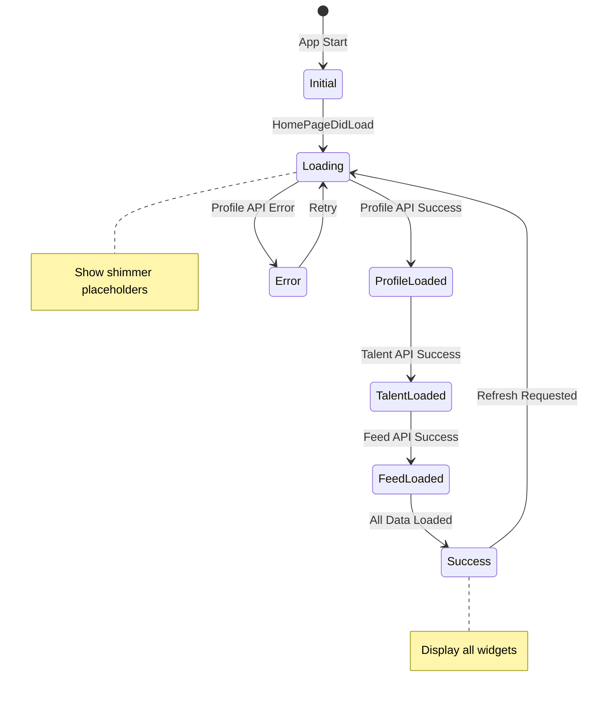

---

## 9. Notification Flow

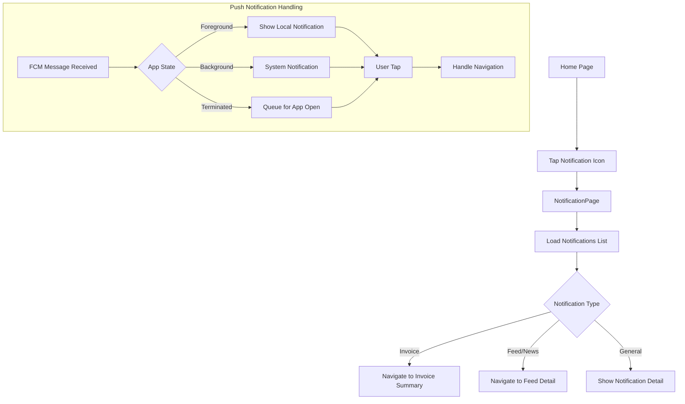

---

## 10. Top Up Saldo Bottom Sheet

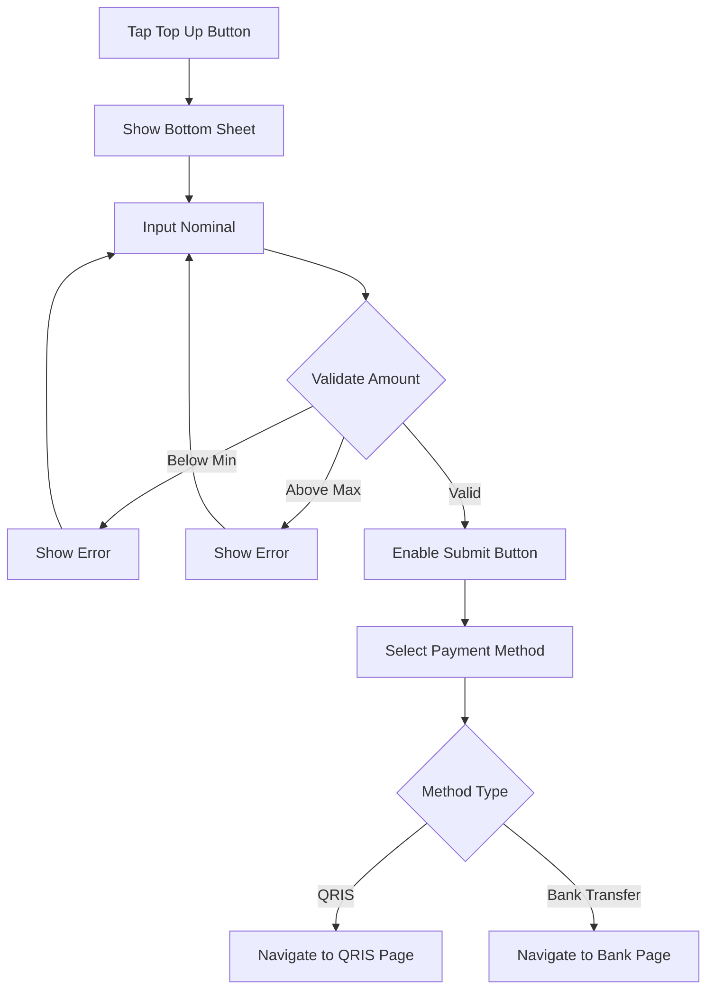

---

## Components

### BLoC Files
- `home_page_bloc.dart` - Home page business logic
- `history_page_bloc.dart` - History page logic
- `profile_page_bloc.dart` - Profile page logic

### Views
- `main_page.dart` - Main container with bottom nav
- `home_page.dart` - Dashboard home
- `history_page.dart` - Transaction history
- `profile_page.dart` - User profile

### Widgets
- `bouncing_icon.dart` - Animated notification icon
- `talent_pool_widget.dart` - Talent pool display
- `list_section_talent.dart` - Talent list section
- `list_section_leader.dart` - Leader list section
- `card_feed_empty.dart` - Empty feed placeholder

---

## Data Flow

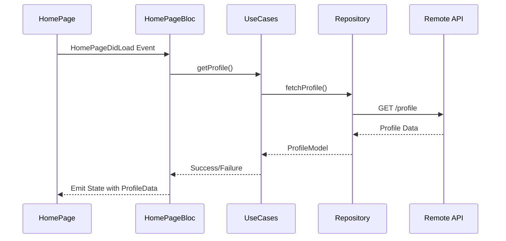
