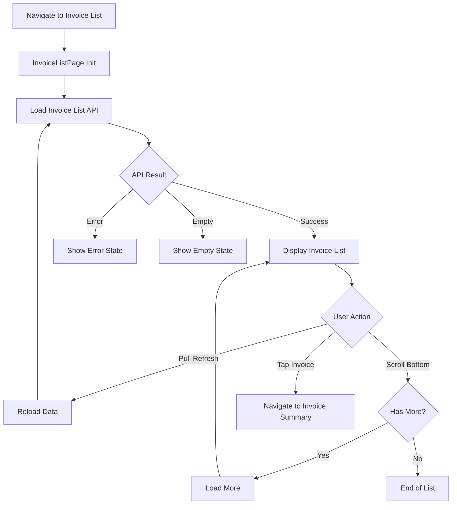
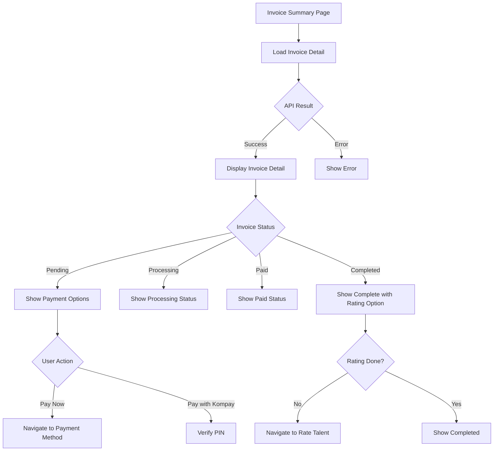
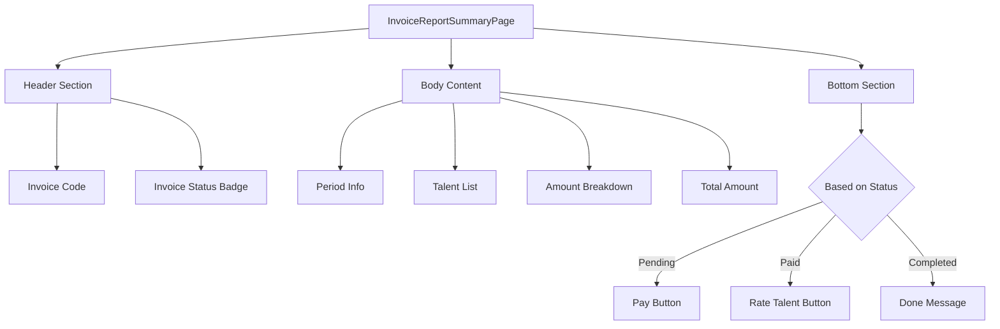
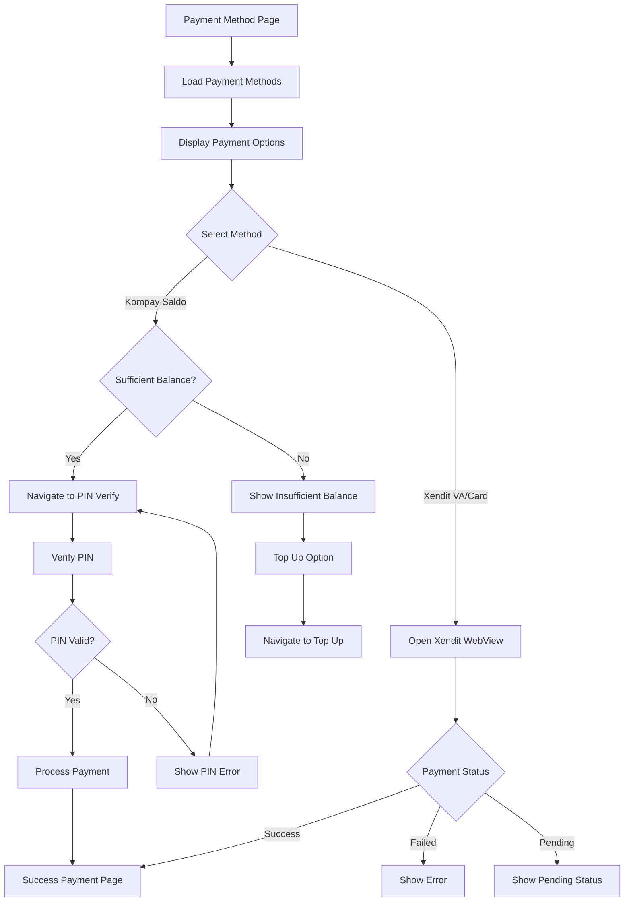
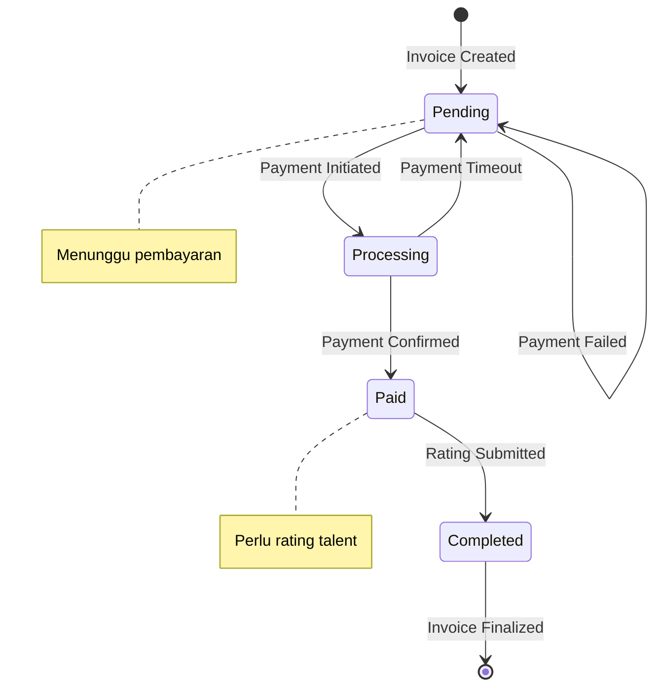
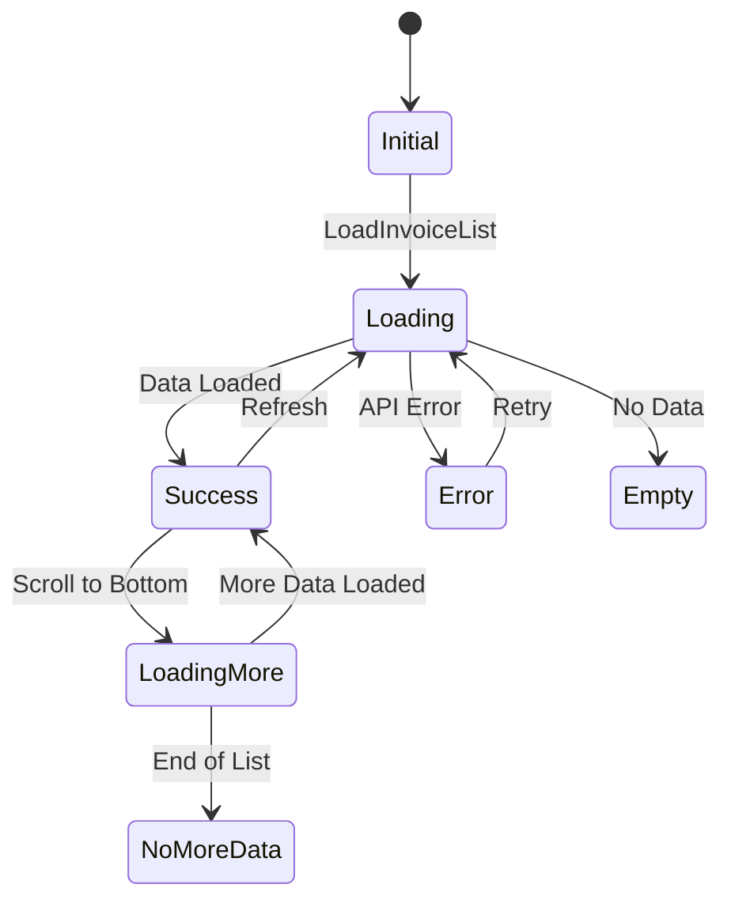
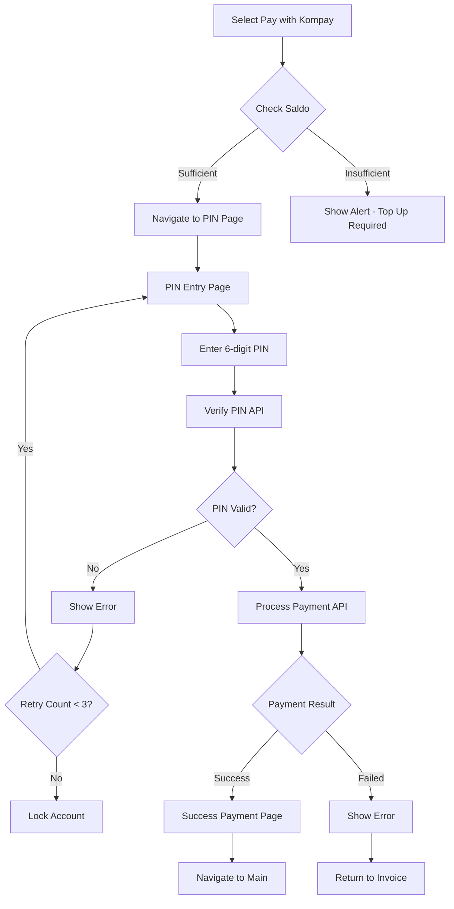
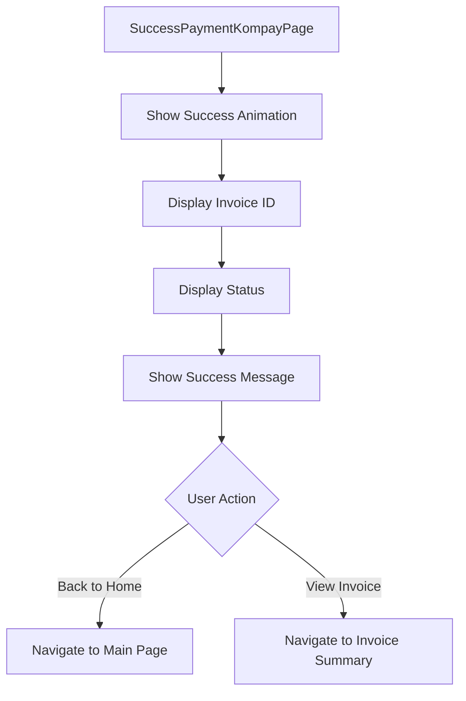
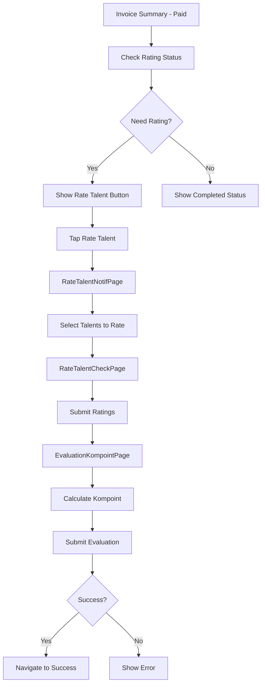

# Invoice Management Flow

## Deskripsi
Flow manajemen invoice mencakup daftar invoice, detail ringkasan, dan proses pembayaran.

---

## 1. Invoice List Flow



---

## 2. Invoice Report Summary Flow



---

## 3. Invoice Detail Components



---

## 4. Payment Method Selection Flow



---

## 5. Invoice Status State Machine



---

## 6. Invoice BLoC State Flow



---

## 7. Payment via Kompay Flow



---

## 8. Success Payment Flow



---

## 9. Invoice with Rating Flow



---

## Components

### BLoC Files
- `invoice_list_bloc.dart` - Invoice list logic
- `invoice_report_summary_bloc.dart` - Invoice detail logic
- `payment_method_bloc.dart` - Payment selection logic

### Views
- `invoice_list_page.dart` - List all invoices
- `invoice_report_summary_page.dart` - Invoice detail
- `payment_method_page.dart` - Payment selection
- `success_payment_kompay_page.dart` - Success confirmation

### Widgets
- `invoice_item.dart` - Invoice list item
- `custom_outline_button.dart` - Action buttons

---

## API Endpoints

| Endpoint | Method | Description |
|----------|--------|-------------|
| `/invoices` | GET | Get invoice list |
| `/invoices/{id}` | GET | Get invoice detail |
| `/invoices/{id}/pay` | POST | Process payment |
| `/payment-methods` | GET | Get available methods |

---

## Data Models

```dart
class InvoicesModel {
  final int id;
  final String invoiceCode;
  final String status;
  final int totalAmount;
  final DateTime dueDate;
  // ...
}

class InvoiceDetailModel {
  final int id;
  final String invoiceCode;
  final List<TalentItem> talents;
  final PaymentInfo payment;
  // ...
}
```
