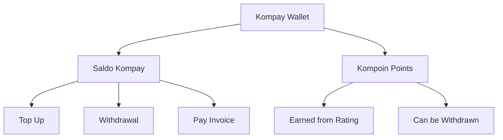
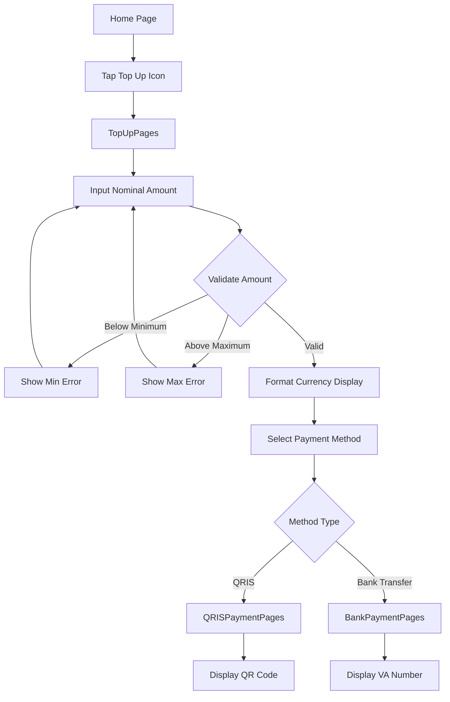
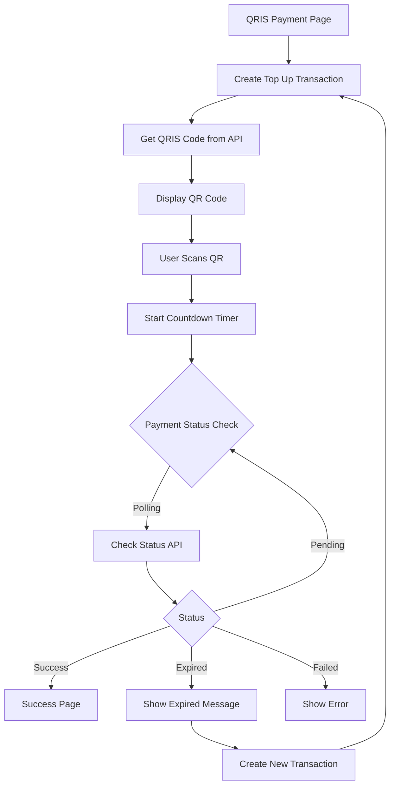
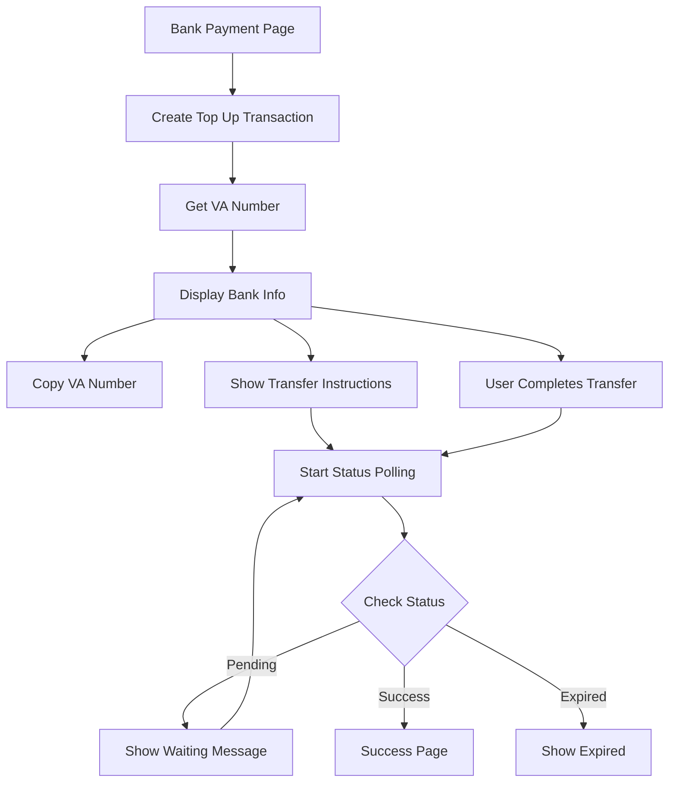
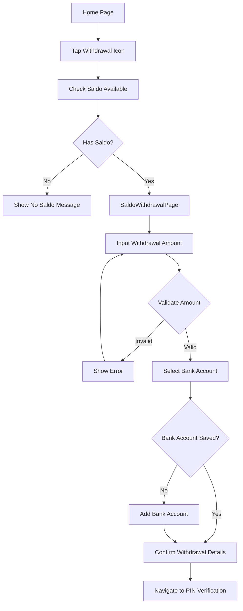
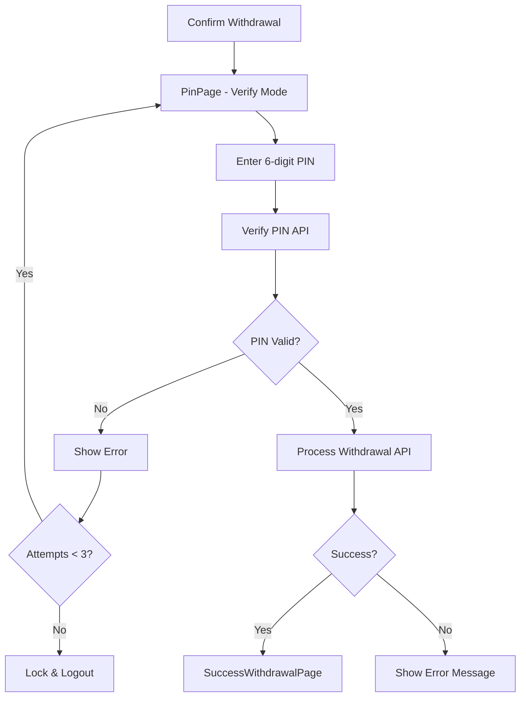
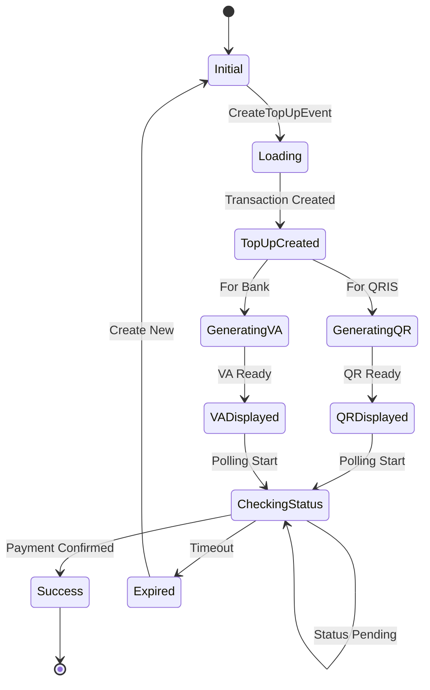
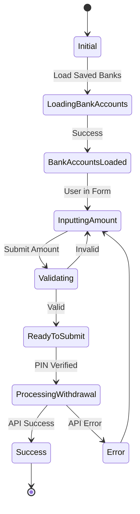
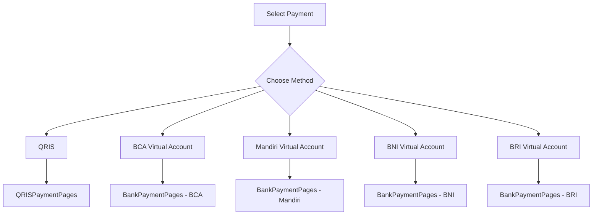
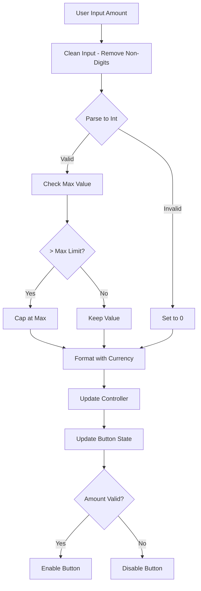

# Kompay Wallet Flow

## Deskripsi
Flow wallet Kompay mencakup top up saldo, pembayaran QRIS, transfer bank, dan penarikan saldo.

---

## 1. Kompay Overview

---

## 2. Top Up Flow

---

## 3. QRIS Payment Flow

---

## 4. Bank Transfer Flow

---

## 5. Saldo Withdrawal Flow

---

## 6. Withdrawal PIN Verification

---

## 7. Top Up BLoC Flow

---

## 8. Withdrawal BLoC Flow

---

## 9. Payment Method Selection

---

## 10. Currency Input Formatting

---

## Components

### BLoC Files
- `topup_bloc.dart` - Top up logic
- `saldo_withdrawal_bloc.dart` - Withdrawal logic

### Views
- `topup_pages.dart` - Top up form
- `qrispayment_pages.dart` - QRIS payment display
- `bankpayment_pages.dart` - Bank transfer display
- `saldo_withdrawal_page.dart` - Withdrawal form
- `success_witdrawal_page.dart` - Success confirmation

### Widgets
- `custom_radiolist_tile.dart` - Payment method selector

---

## API Endpoints

| Endpoint | Method | Description |
|----------|--------|-------------|
| `/topup/create` | POST | Create top up transaction |
| `/topup/status/{id}` | GET | Check payment status |
| `/topup/qris/{id}` | GET | Get QRIS code |
| `/withdrawal/create` | POST | Create withdrawal |
| `/bank-accounts` | GET | Get saved bank accounts |

---

## Amount Limits

| Type | Minimum | Maximum |
|------|---------|---------|
| Top Up | Rp 10.000 | Rp 10.000.000 |
| Withdrawal | Rp 50.000 | (Saldo Available) |
