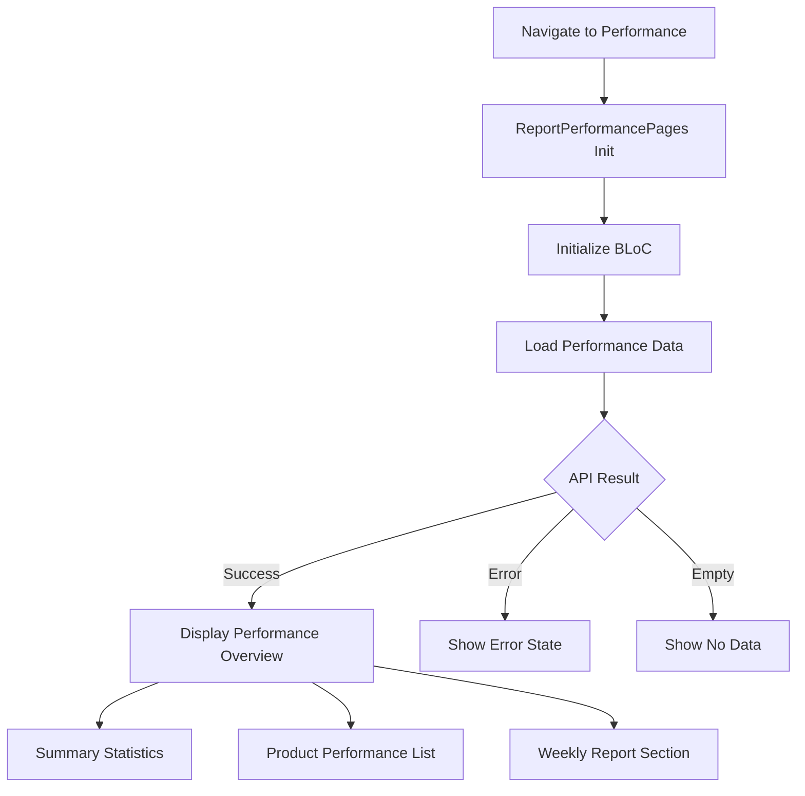
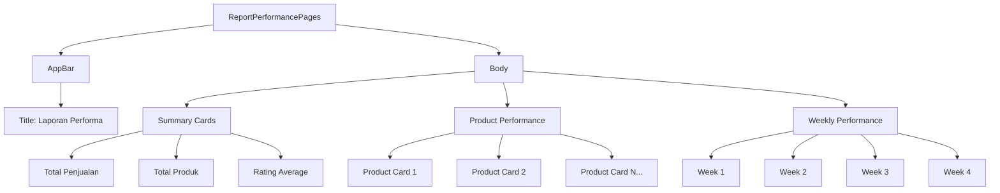
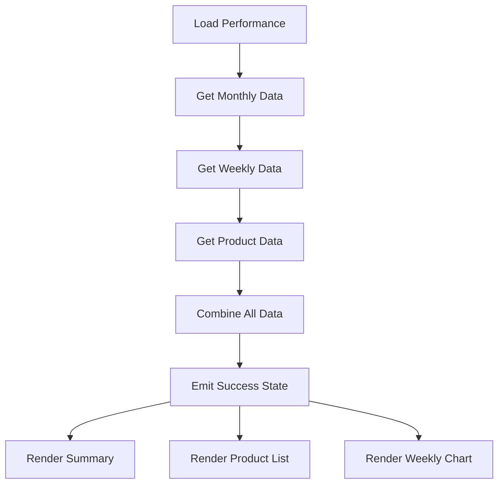
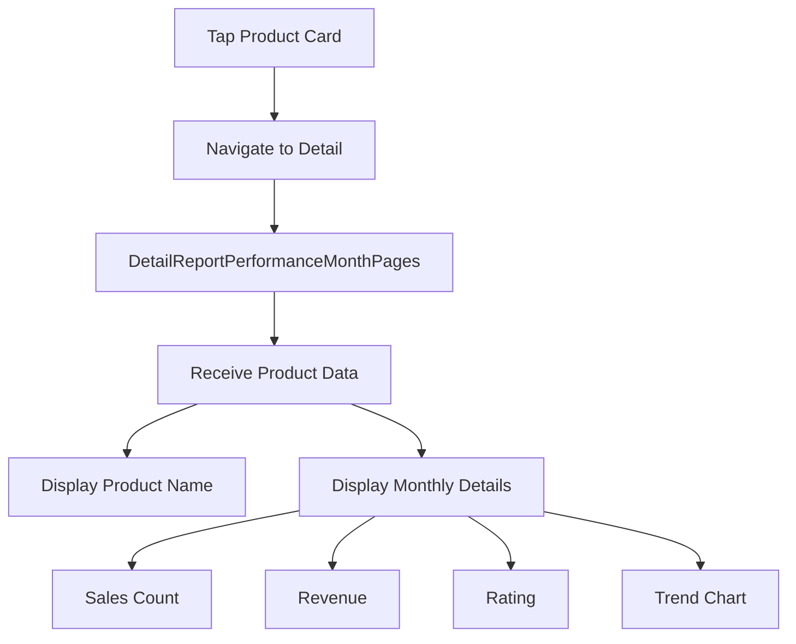
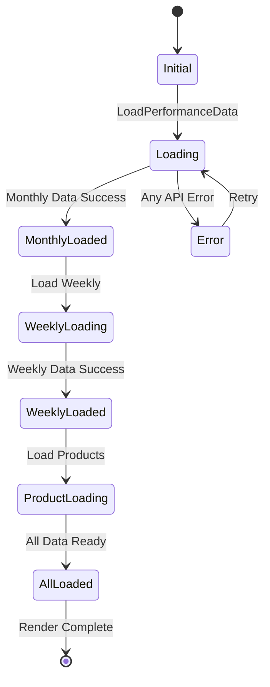
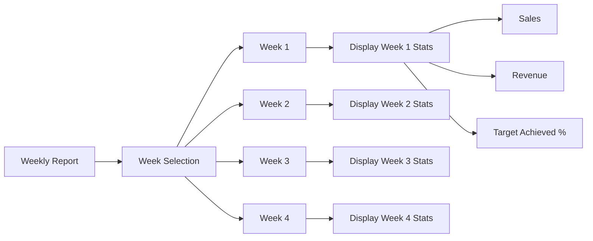
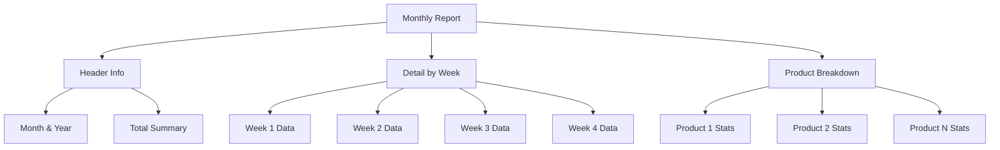
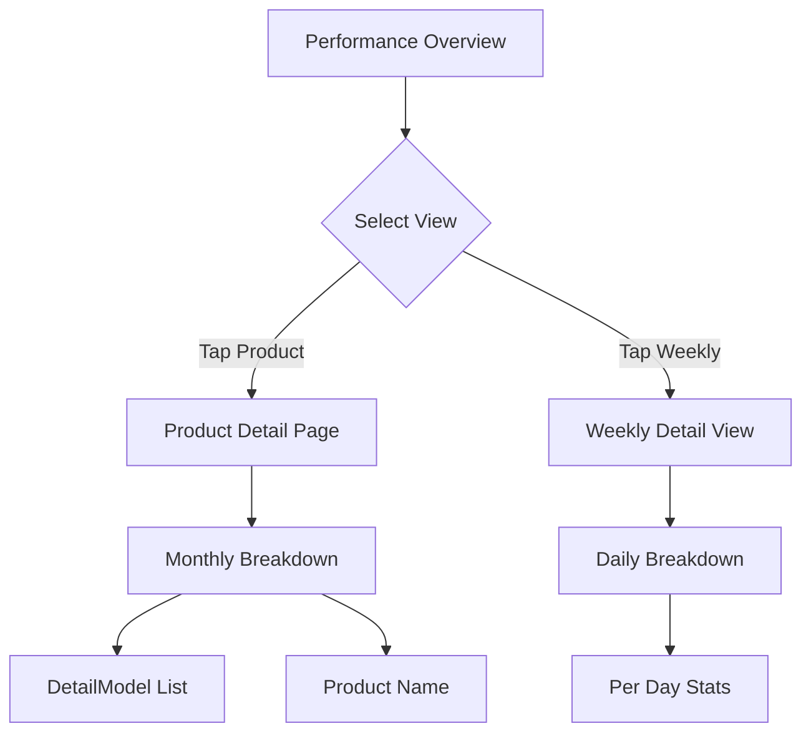
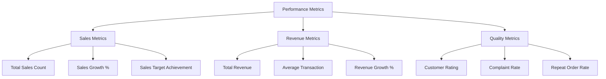
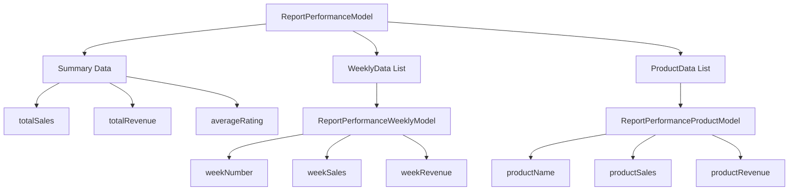

# Performance Reports Flow

## Deskripsi
Flow laporan performa mencakup overview performa, laporan mingguan, dan detail performa bulanan per produk.

---

## 1. Performance Overview Flow



---

## 2. Performance Page Structure



---

## 3. Performance Data Flow



---

## 4. Product Performance Detail



---

## 5. Performance BLoC State



---

## 6. Weekly Performance Display



---

## 7. Monthly Report Structure



---

## 8. Detail Report Navigation



---

## 9. Performance Metrics



---

## 10. Data Model Flow



---

## Components

### BLoC Files
- `report_performance_bloc.dart` - Performance report logic
- `report_performance_event.dart` - Events
- `report_performance_state.dart` - States

### Views
- `report_performance_pages.dart` - Main performance page
- `detail_report_performance_month_pages.dart` - Monthly detail

### Widgets
- Performance summary cards
- Product performance cards
- Weekly chart widgets

---

## Data Models

```dart
class ReportPerformanceModel {
  final int totalSales;
  final int totalRevenue;
  final double averageRating;
  final List<WeeklyModel> weeklyData;
  final List<ProductModel> productData;
}

class ReportPerformanceMonthlyModel {
  final String month;
  final List<DetailModel> details;
}

class DetailModel {
  final String name;
  final int value;
  final String type;
}

class ReportPerformanceWeeklyModel {
  final int weekNumber;
  final int sales;
  final int revenue;
  final double target;
}

class ReportPerformanceProductModel {
  final String productName;
  final int sales;
  final int revenue;
}
```

---

## API Endpoints

| Endpoint | Method | Parameters | Description |
|----------|--------|------------|-------------|
| `/performance` | GET | month, year | Get performance overview |
| `/performance/weekly` | GET | month, year | Get weekly breakdown |
| `/performance/product` | GET | month, year | Get product breakdown |
| `/performance/detail/{productId}` | GET | month, year | Get product detail |
