# PIN Management Flow

## Deskripsi
Flow PIN management mencakup pengaturan PIN baru, verifikasi PIN untuk transaksi, update PIN, dan verifikasi email OTP.

---

## 1. PIN Management Overview

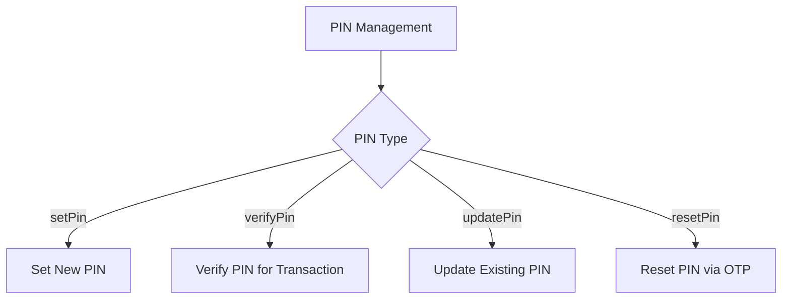

---

## 2. Set New PIN Flow

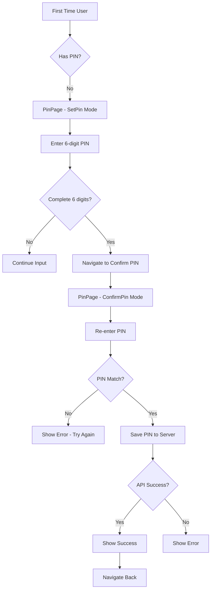

---

## 3. PIN Entry UI Components

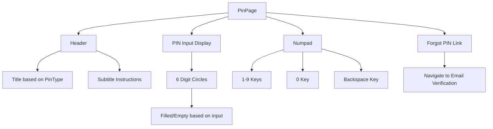

---

## 4. Verify PIN Flow

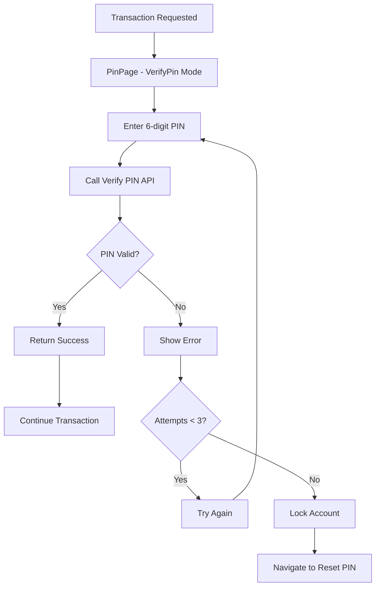

---

## 5. Update PIN Flow

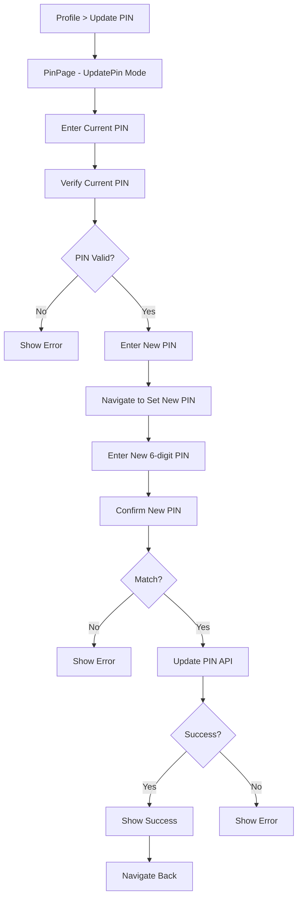

---

## 6. Email Verification Flow

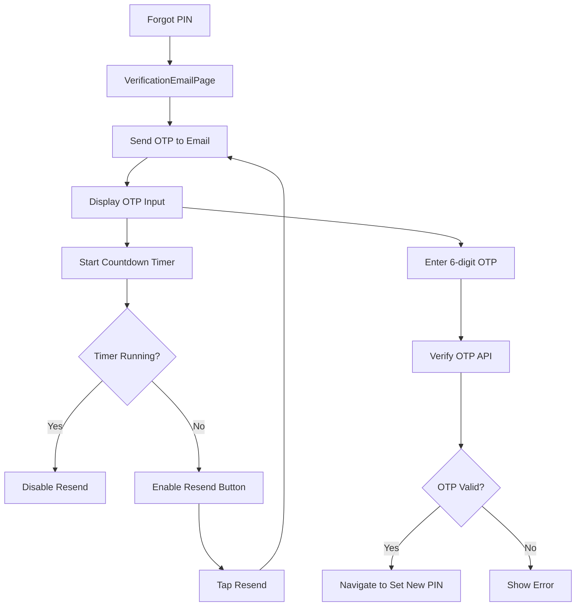

---

## 7. PIN BLoC State Flow

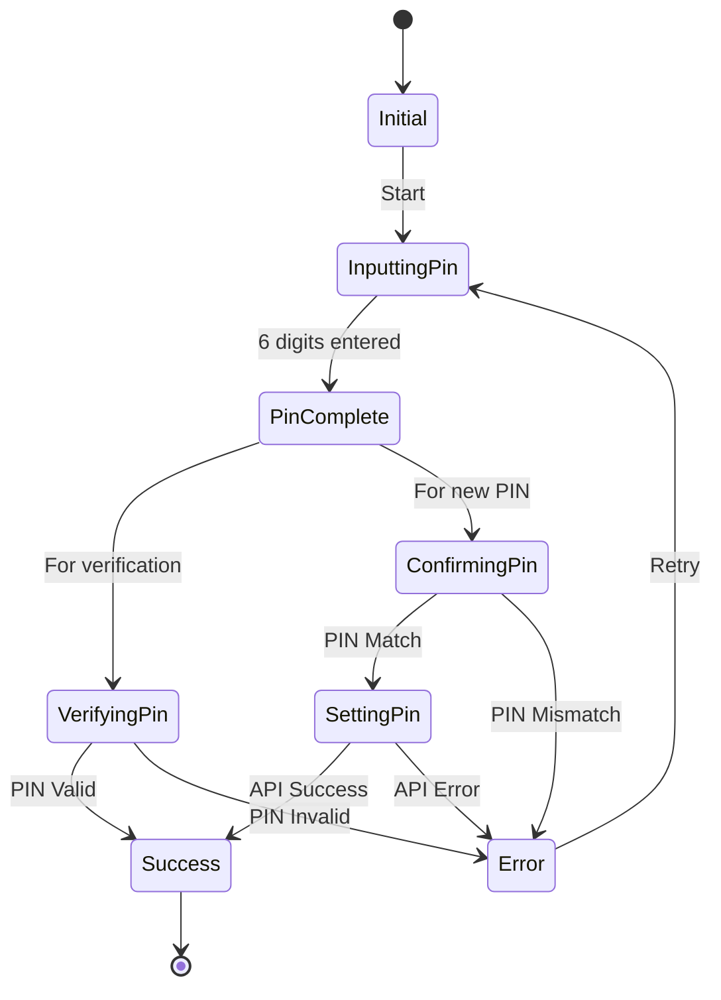

---

## 8. PIN Type Enum

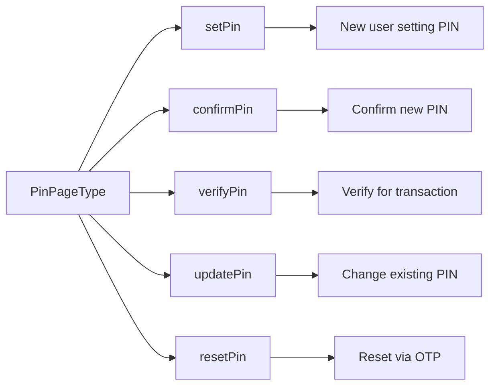

---

## 9. OTP Countdown Timer

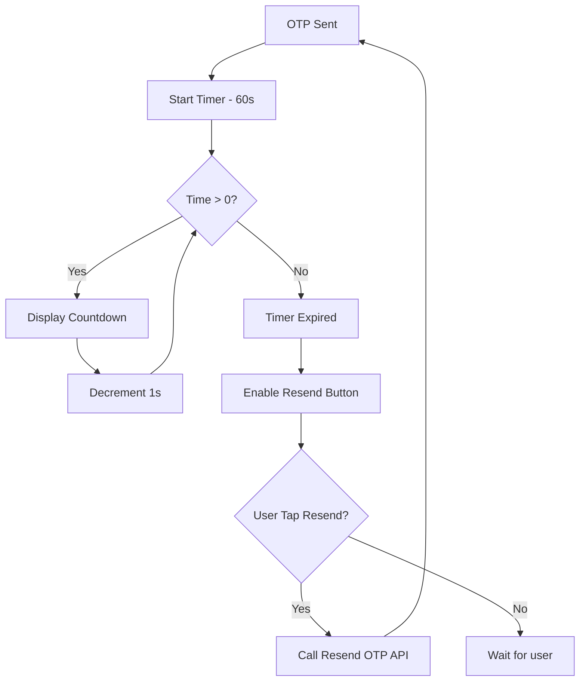

---

## 10. PIN Validation Rules

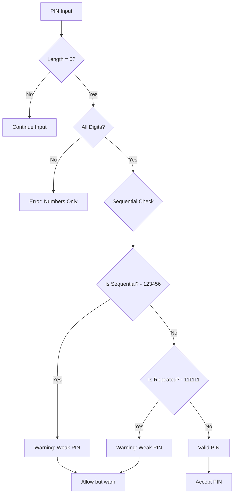

---

## 11. Transaction PIN Verification

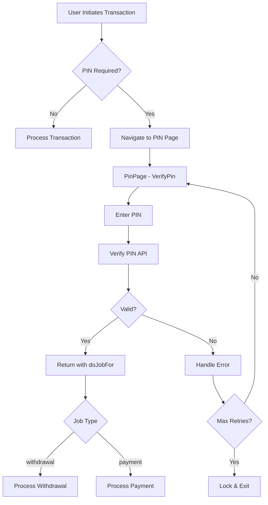

---

## Components

### BLoC Files
- `pin_bloc.dart` - PIN management logic
- `pin_event.dart` - Events
- `pin_state.dart` - States

### Views
- `pin_page.dart` - PIN entry screen
- `verification_email_page.dart` - OTP verification
- `pop_up_page.dart` - PIN popups/dialogs

### Widgets
- Custom PIN input display
- Numpad widget
- Timer display

---

## Data Models

```dart
class CheckPinModel {
  final bool hasPin;
}

class VerifyPinModel {
  final bool isValid;
  final String? message;
  final int remainingAttempts;
}
```

---

## API Endpoints

| Endpoint | Method | Description |
|----------|--------|-------------|
| `/pin/check` | GET | Check if user has PIN |
| `/pin/set` | POST | Set new PIN |
| `/pin/verify` | POST | Verify PIN |
| `/pin/update` | PUT | Update PIN |
| `/pin/reset` | POST | Reset PIN request |
| `/otp/send` | POST | Send OTP to email |
| `/otp/verify` | POST | Verify OTP code |

---

## Security Considerations

| Rule | Implementation |
|------|----------------|
| Max attempts | 3 attempts before lock |
| Lock duration | 30 minutes or until OTP reset |
| PIN storage | Hashed on server only |
| OTP expiry | 5 minutes |
| Resend cooldown | 60 seconds |
