# Talent Rating Flow

## Deskripsi
Flow rating talent mencakup notifikasi rating, form penilaian talent, dan evaluasi Kompoint.

---

## 1. Rate Talent Overview

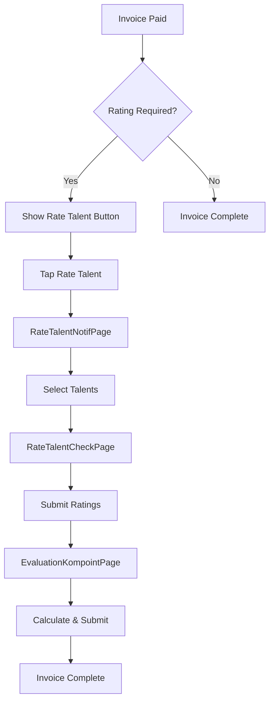

---

## 2. Rate Talent Notification Flow

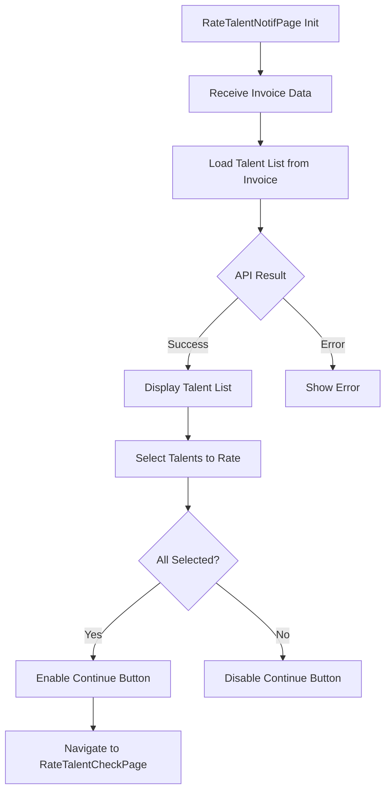

---

## 3. Talent Rating Form Flow

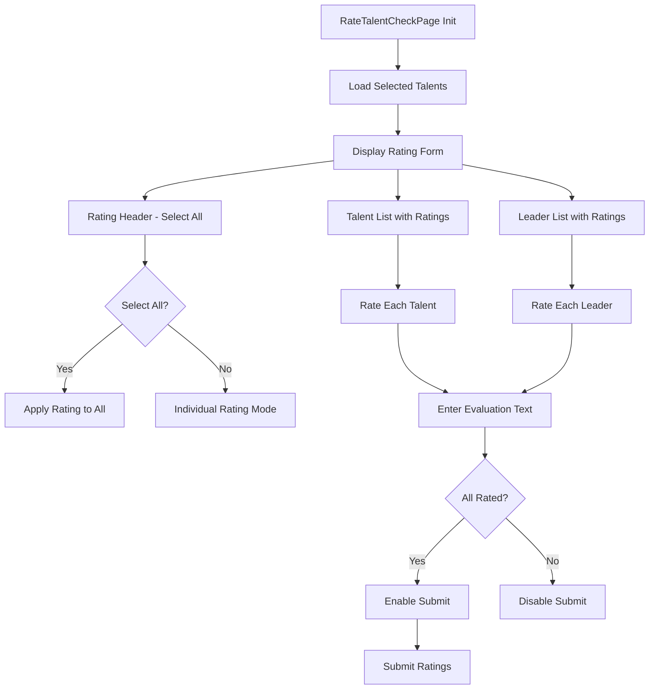

---

## 4. Rating Star Component

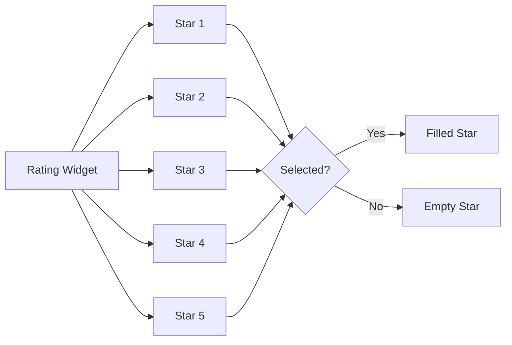

---

## 5. Talent/Leader Rating State

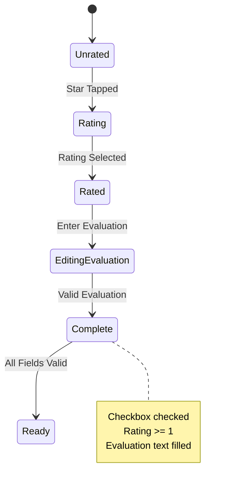

---

## 6. Check All Checkbox Flow

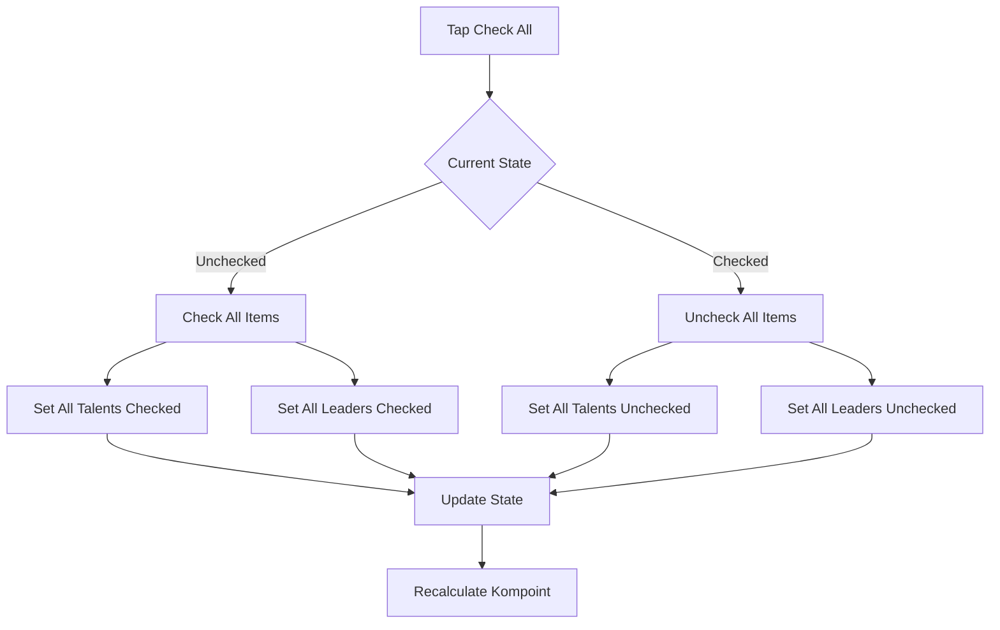

---

## 7. Rating Calculation Flow

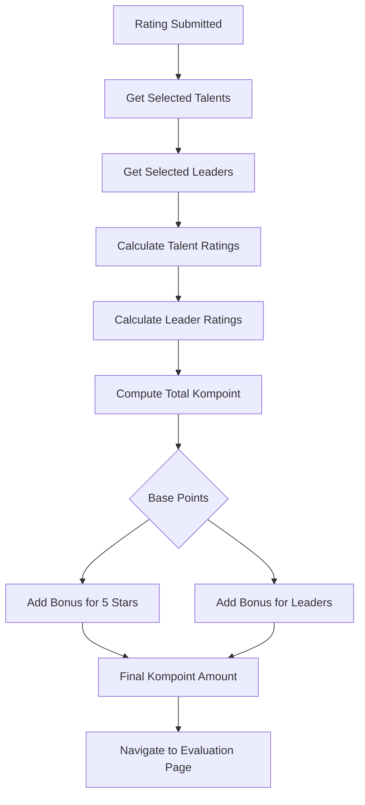

---

## 8. Evaluation Kompoint Page

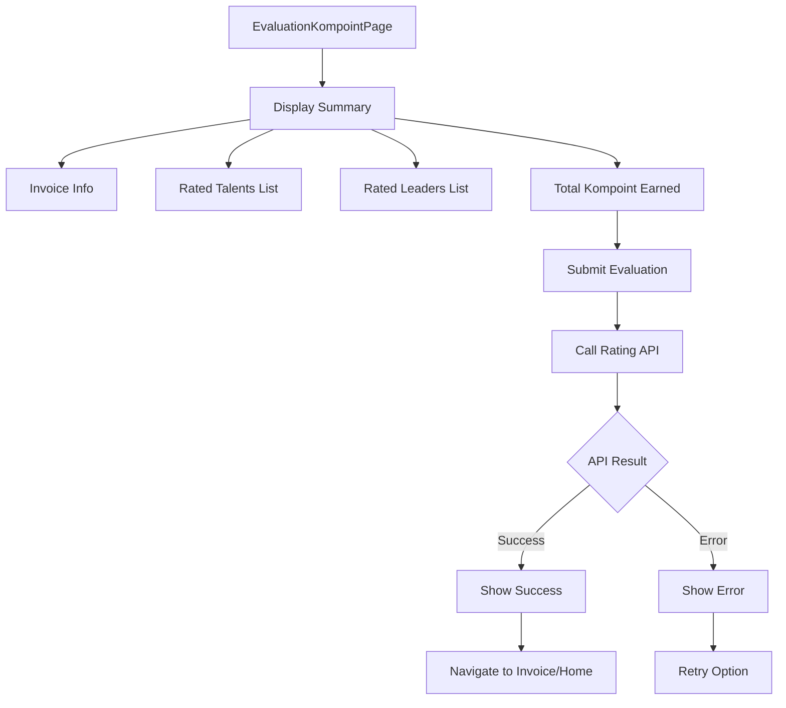

---

## 9. Rating BLoC State Flow

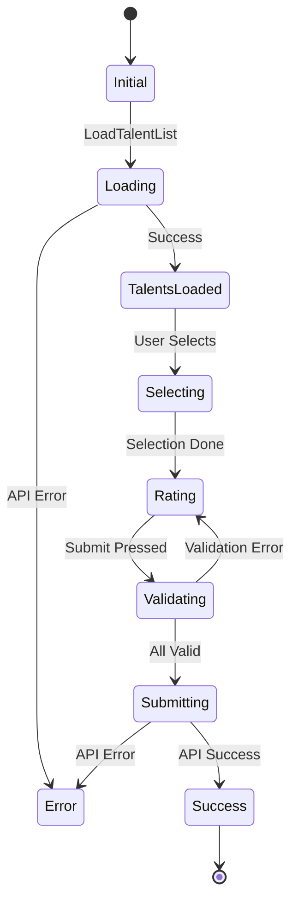

---

## 10. Rating Item Row Component

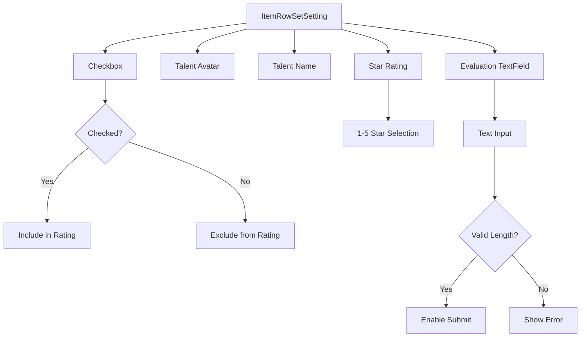

---

## 11. WebView Payment (Xendit)

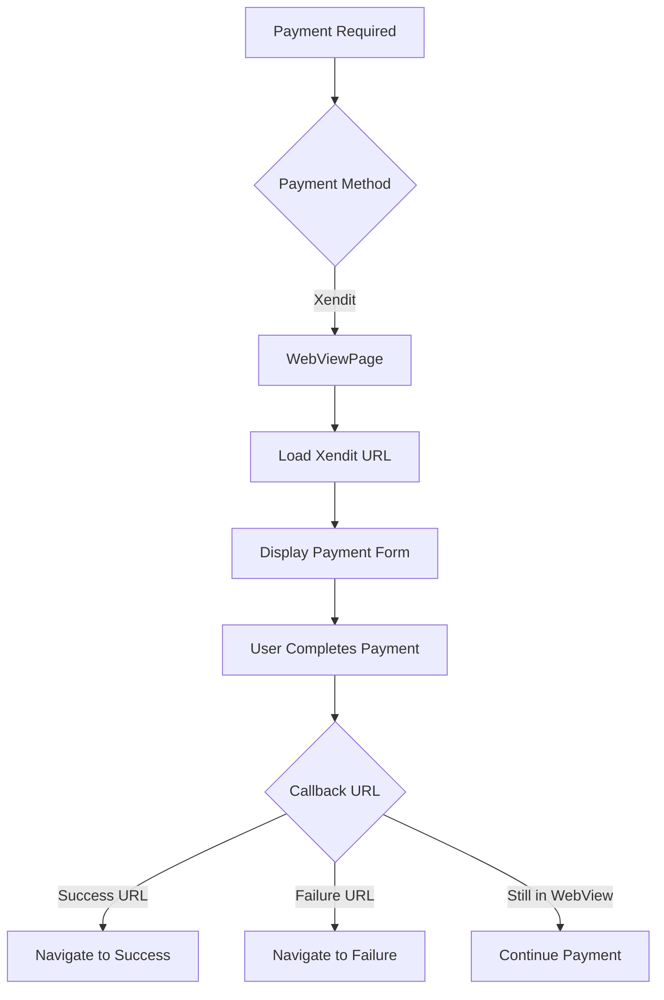

---

## Components

### BLoC Files
- `rate_talent_bloc.dart` - Rating logic
- `rate_talent_event.dart` - Events
- `rate_talent_state.dart` - States

### Views
- `rate_talent_notif_page.dart` - Rating notification/selection
- `rate_talent_check_page.dart` - Rating form
- `evaluation_kompoint_page.dart` - Kompoint summary
- `web_view_page.dart` - Xendit payment

### Widgets
- `item_row_set_setting.dart` - Rating row item
- `rating_info_widget.dart` - Rating information display

---

## Data Models

```dart
class TalentsDataModel {
  final int id;
  final String name;
  final String? avatar;
  bool isChecked;
  int rating;
  String evaluation;
}

class TalentLeaderModel {
  final int id;
  final String name;
  final String? avatar;
  bool isChecked;
  int rating;
  String evaluation;
}
```

---

## Kompoint Calculation

| Condition | Points |
|-----------|--------|
| Base rating per talent | 10 points |
| 5-star rating bonus | +5 points |
| Leader rating bonus | +15 points |
| All talents rated | +20 points bonus |

---

## API Endpoints

| Endpoint | Method | Description |
|----------|--------|-------------|
| `/invoice/{id}/talents` | GET | Get talents to rate |
| `/rating/submit` | POST | Submit talent ratings |
| `/rating/kompoint` | POST | Submit kompoint evaluation |
