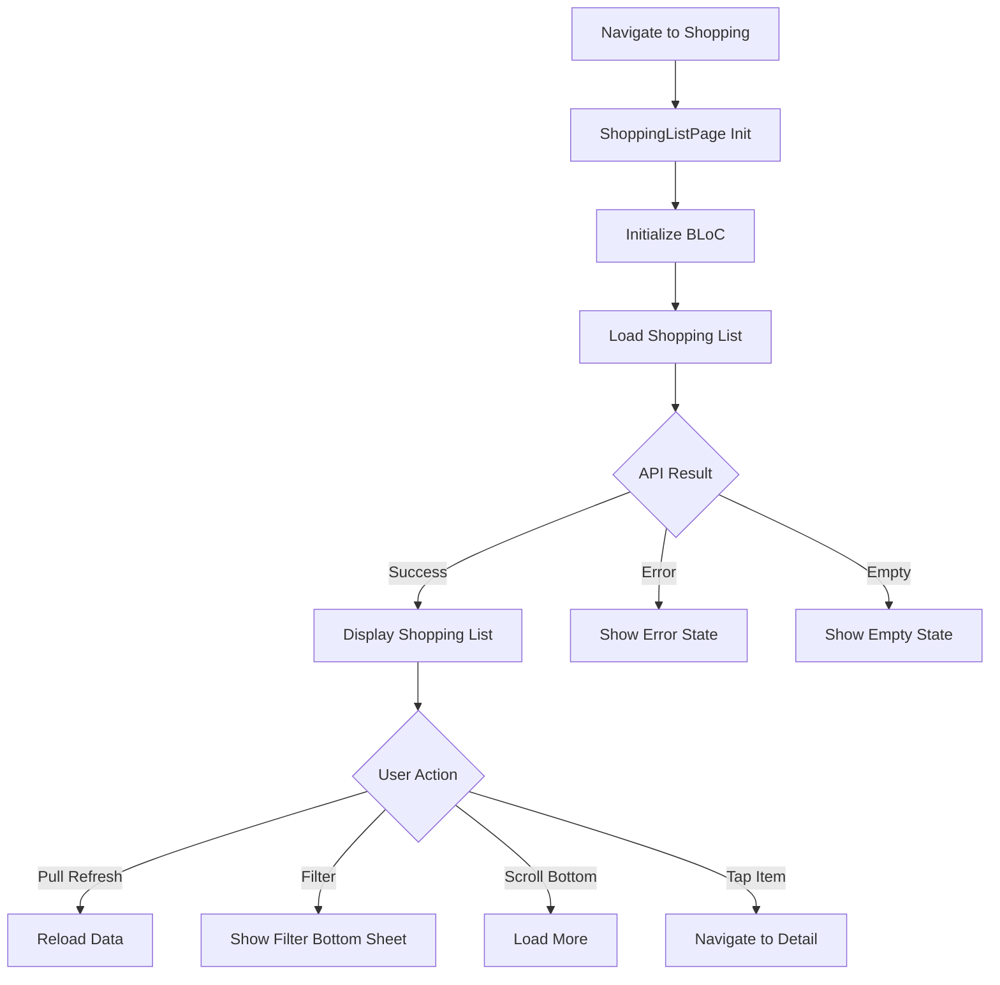
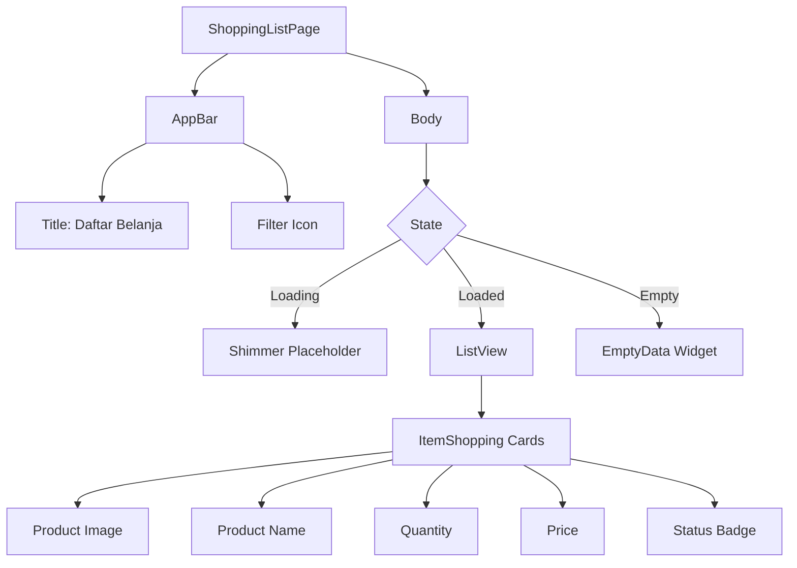
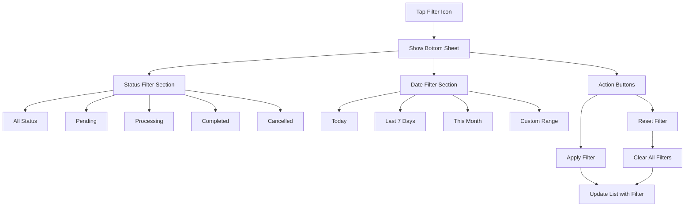
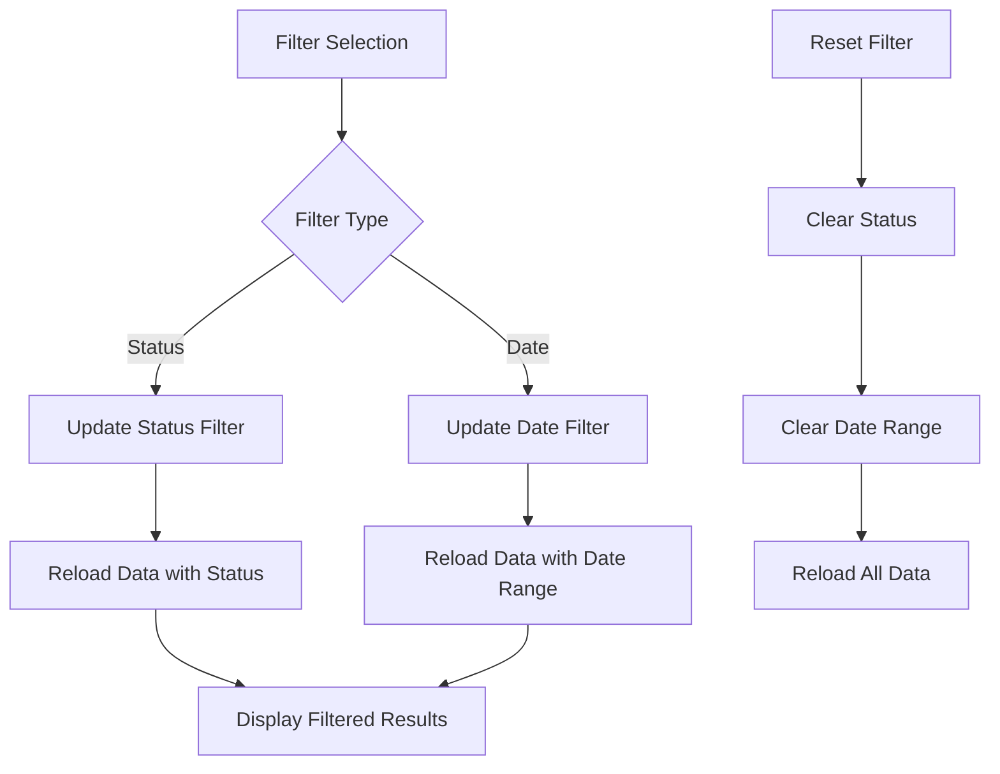
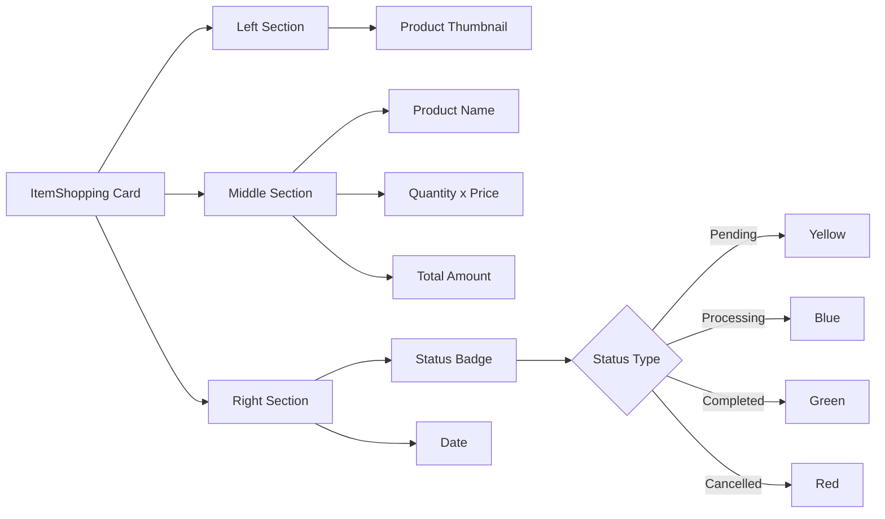
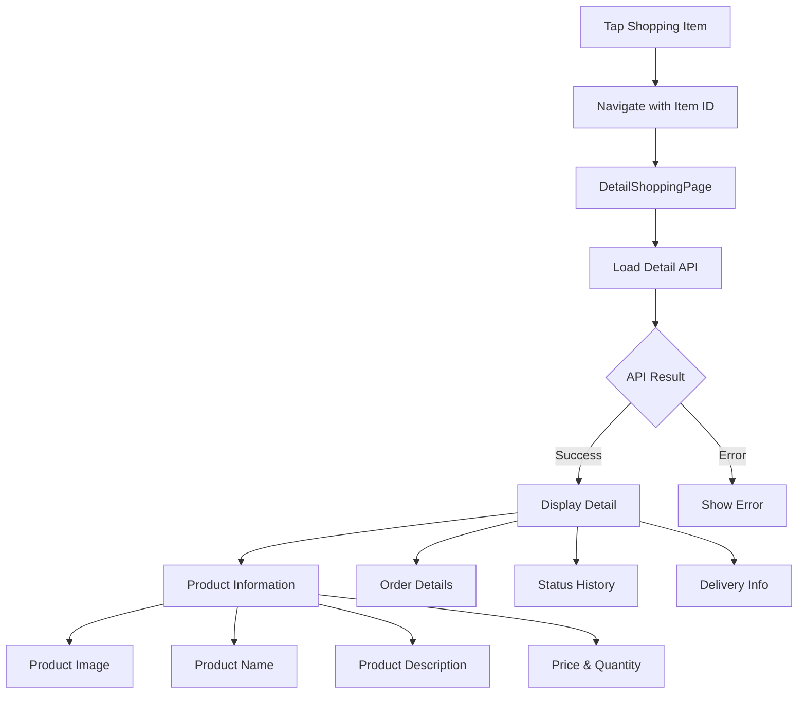
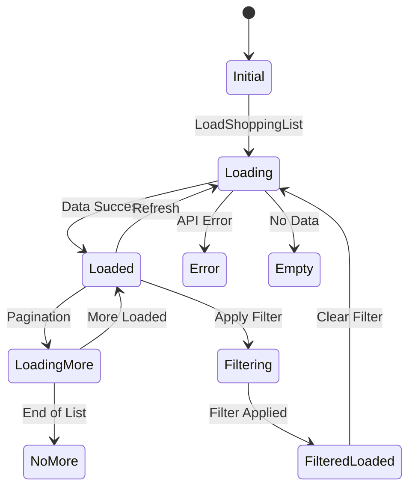
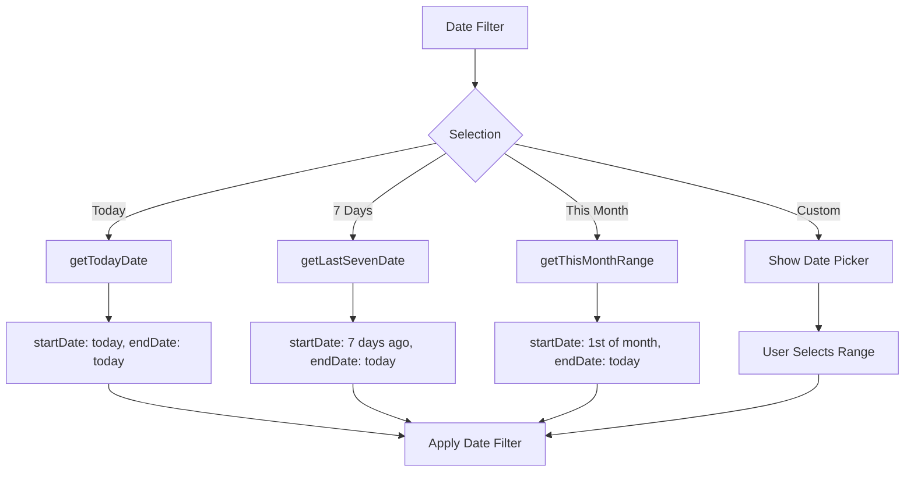
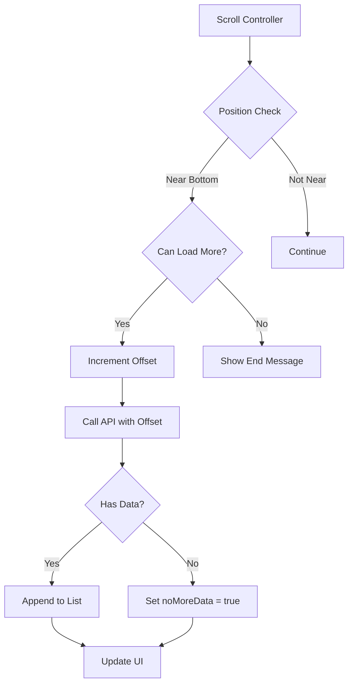
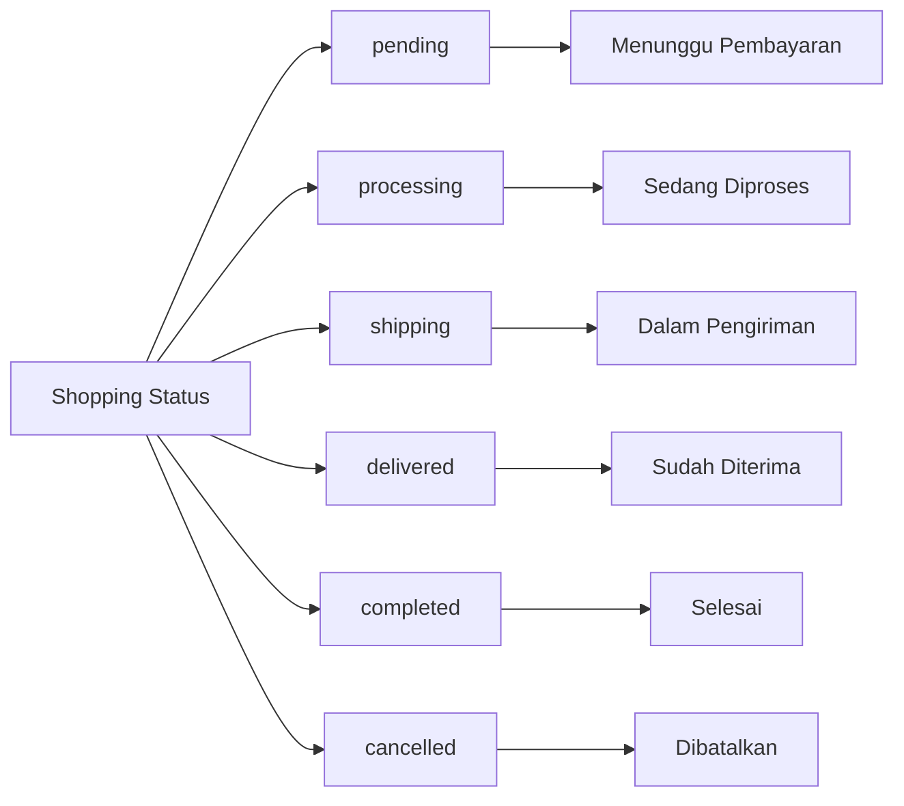

# Shopping Management Flow

## Deskripsi
Flow shopping mencakup daftar belanja, filter berdasarkan status dan tanggal, serta detail item shopping.

---

## 1. Shopping List Flow



---

## 2. Shopping List Components



---

## 3. Filter Bottom Sheet Flow



---

## 4. Filter State Management



---

## 5. Shopping Item Card



---

## 6. Detail Shopping Flow



---

## 7. Shopping BLoC State



---

## 8. Date Filter Options



---

## 9. Load More Pagination



---

## 10. Shopping Status Types



---

## Components

### BLoC Files
- `shopping_bloc.dart` - Shopping list logic
- `shopping_event.dart` - Events
- `shopping_state.dart` - States

### Views
- `shopping_list_page.dart` - Shopping list
- `detail_shopping_page.dart` - Shopping detail

### Widgets
- `item_shopping.dart` - List item card
- `empty_data.dart` - Empty state widget
- `bottom_sheet_filter.dart` - Filter bottom sheet

---

## Data Models

```dart
class ShoppingListDataModel {
  final int id;
  final String productName;
  final String productImage;
  final int quantity;
  final int price;
  final int totalAmount;
  final String status;
  final DateTime orderDate;
}

class DetailShoppingModel {
  final int id;
  final ProductInfo product;
  final OrderInfo order;
  final DeliveryInfo delivery;
  final List<StatusHistory> statusHistory;
}
```

---

## API Endpoints

| Endpoint | Method | Parameters | Description |
|----------|--------|------------|-------------|
| `/shopping` | GET | status, startDate, endDate, limit, offset | Get shopping list |
| `/shopping/{id}` | GET | - | Get shopping detail |
