# Unhire Talent Flow

## Deskripsi
Flow unhire talent mencakup pemilihan talent yang akan di-unhire, input alasan, dan konfirmasi penyelesaian.

---

## 1. Unhire Overview Flow

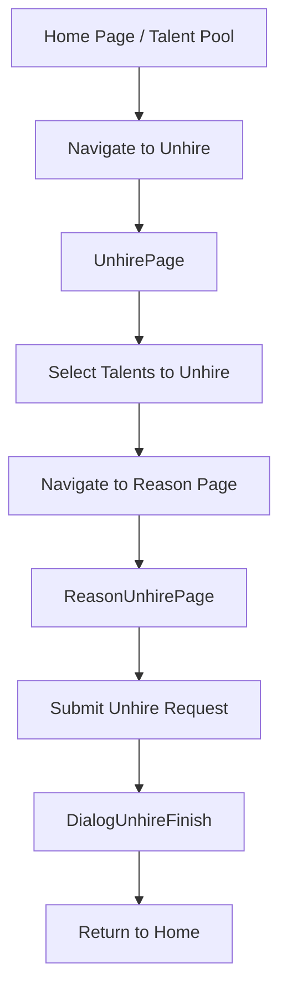

---

## 2. Unhire Page Flow

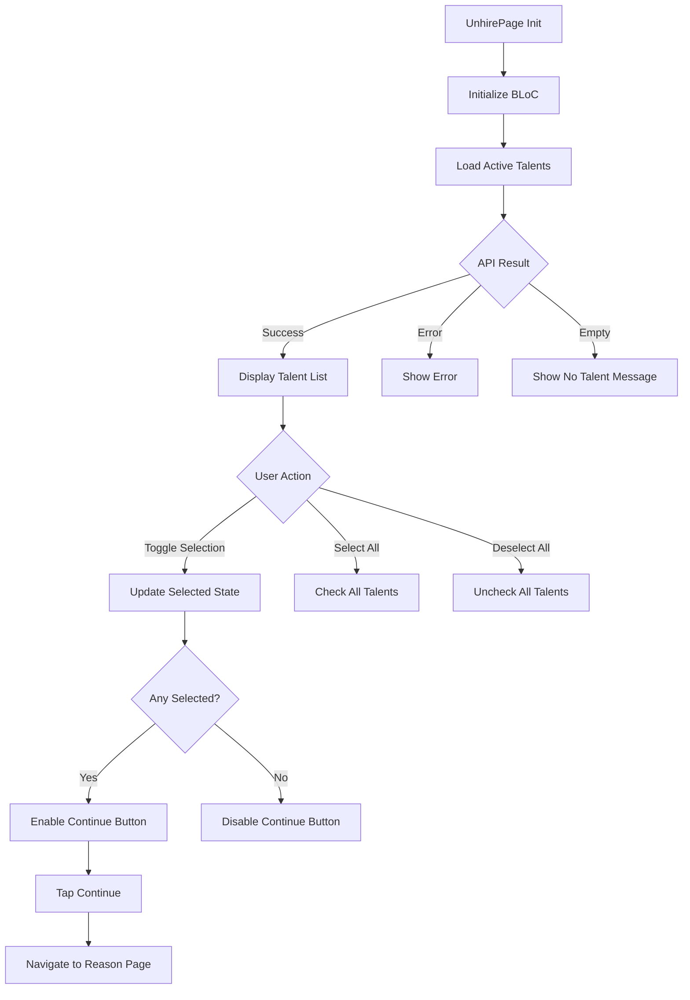

---

## 3. Talent Selection UI

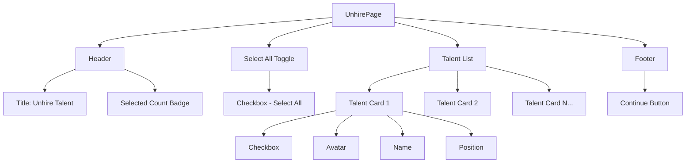

---

## 4. Reason Unhire Flow

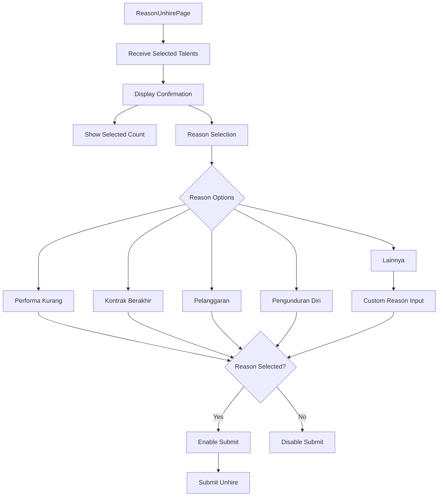

---

## 5. Unhire Reason Options

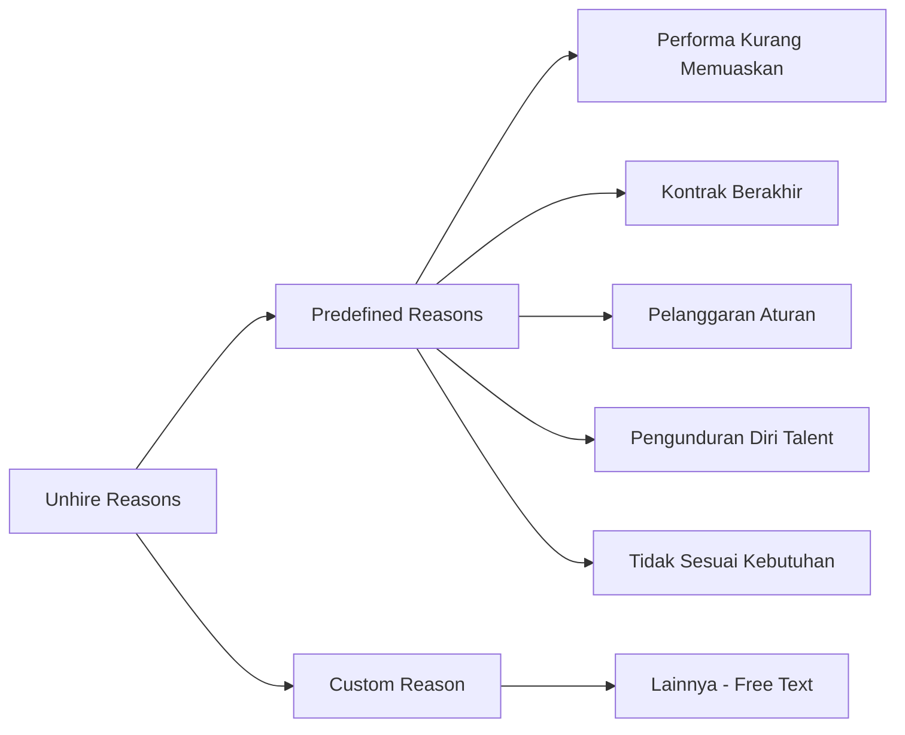

---

## 6. Submit Unhire Flow

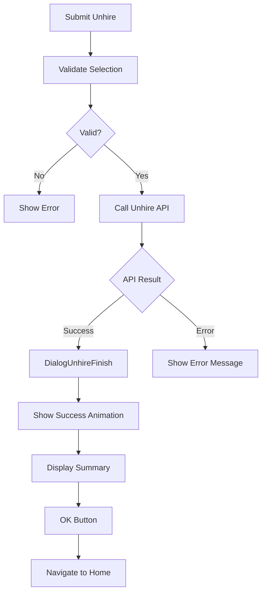

---

## 7. Unhire BLoC State Flow

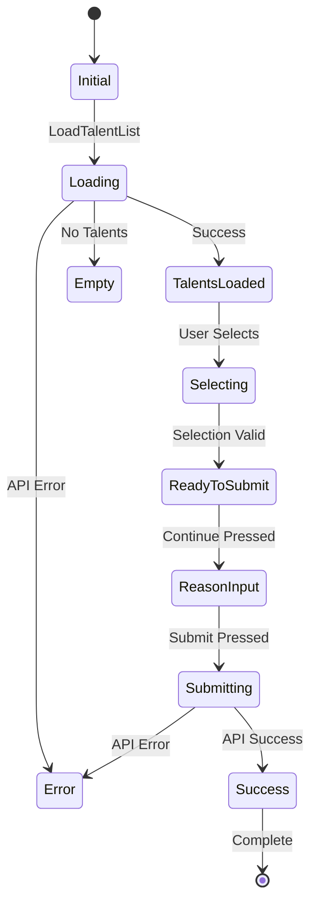

---

## 8. Talent Selection State

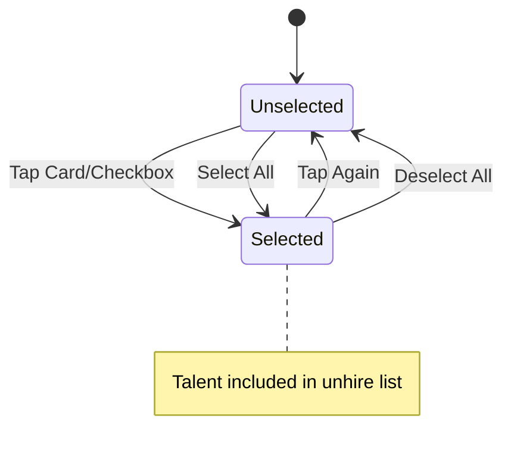

---

## 9. Dialog Unhire Finish

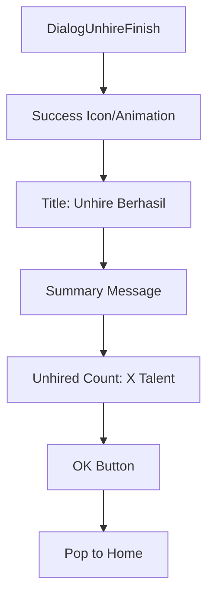

---

## 10. Multi-Step Progress

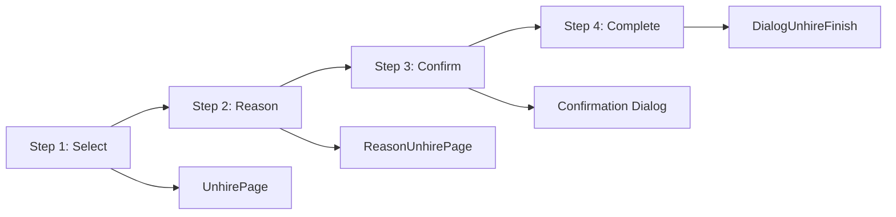

---

## Components

### BLoC Files
- `talent_list_bloc.dart` - Talent list for unhire
- `talent_list_selected_bloc.dart` - Selected talents management
- Events and States files

### Views
- `unhire_page.dart` - Talent selection
- `reason_unhire_page.dart` - Reason input
- `dialog_unhire_finish.dart` - Success dialog

### Widgets
- Talent selection cards
- Reason radio buttons
- Progress indicators

---

## Data Flow

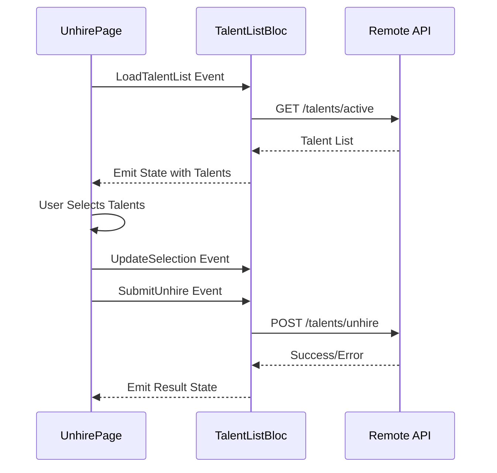

---

## API Endpoints

| Endpoint | Method | Description |
|----------|--------|-------------|
| `/talents/active` | GET | Get active talents list |
| `/talents/unhire` | POST | Submit unhire request |

---

## Request Payload

```json
{
  "talent_ids": [1, 2, 3],
  "reason": "Performa Kurang Memuaskan",
  "custom_reason": null,
  "unhire_date": "2026-01-20"
}
```

---

## Error Handling

| Error | Message | Action |
|-------|---------|--------|
| No selection | "Pilih minimal 1 talent" | Focus on list |
| No reason | "Pilih alasan unhire" | Focus on reason |
| API Error | Error message | Show retry |
| Network Error | "Koneksi bermasalah" | Show retry |
